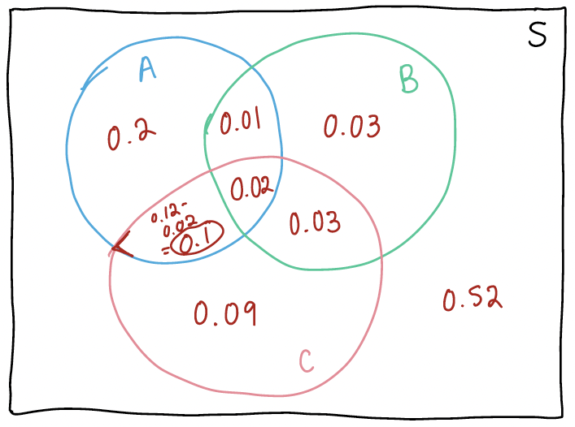

Below are some select answers from the homework.

## Questions

1. (a) {width="500"} (b) Answers for part (ii) for each:

    1.  0.48

    2.  0.52

    3.  0.2

    4.  0.32

    5.  0.03

    6.  0.01

    7.  0.02

2.  (c) 0.384 If you have the right answer to (c), then you should be able to figure out the rest (see (e)).

3. (a) 1 does not hold because $0 \neq \dfrac{1}{216}$      (b) 2 does not hold because $P(B \cap C) \neq P(B)P(C)$ 

4. a. 5/9; b. 2/5; c. 2/4

5. a. 0.71; b. 0.29; c. 48/71; d. 1; e. 25/29; f. 25/39

6. (a) 0.189     (b) 0.811     (c) 0.189
7. a. 4060; b. 24,360;
8.  0.3916

### Extra problems
1. (a) 16, (c) for one, $P(X=10) = \dfrac{5}{16}$, (d) 0.375

3. Calculus review

    a. $c(\frac{y^{2}}{2}+y^{2})$
    b. $\frac{8}{9}xy^{2}+\frac{5}{9}y^{4}$
    c. $\frac{8}{9}x^{2}y+\frac{20}{9}xy^{3}$
    d. $-2e^{-2y}+2e^{-y}$
    e. $xe^{-x}$
    f. $-\frac{2}{3}(e^{-7x}-e^{-4x})$
    g. $\frac{9}{2}$
    h. $\frac{9}{2}$
    i. $\frac{9}{2}$
    j. $\frac{9}{2}$
