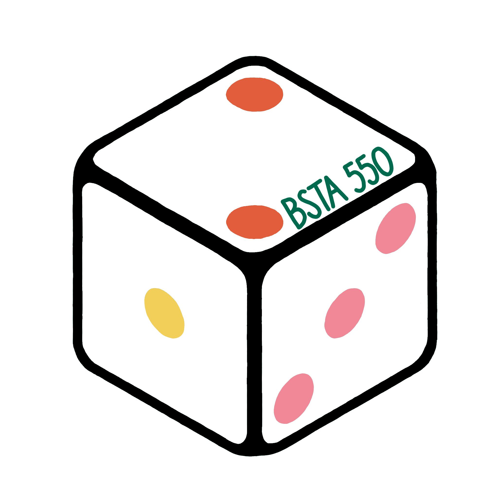

```{r setup, include=FALSE}
library(here)
source(here("class_dates.R"))
```

```{=html}
<style>
/* ---- BSTA 550 color palette ---- */
:root {
  --green:  #006a4e;
  --blue:   #6B8CC4;  --blue-text:   #4F70AD;
  --orange: #E25D3B;  --orange-text: #C24A2A;
  --pink:   #F08897;  --pink-deep:   #C9445A;
  --yellow: #F1CF58;
  --ivory:  #F2EFEA;
}

/* ---- Welcome banner ---- */
.hero {
  background-color: var(--green);
  color: white;
  border-radius: 16px;
  padding: 2rem 2rem 1.5rem 2rem;
  margin-bottom: 1.5rem;
  align-items: center;
}
.hero h1 {
  color: white;
  border-bottom: none;
  margin-top: 0;
  font-size: 2.2rem;
  font-weight: 700;
}
.hero img { border-radius: 12px; }
.term-pill {
  display: inline-block;
  background-color: var(--yellow);
  color: #1F3B30;
  font-weight: 700;
  padding: 0.2em 0.9em;
  border-radius: 999px;
  margin-bottom: 0.75rem;
}
.hero-text { font-size: 1.08rem; line-height: 1.6; }
.hero-text strong { color: white; }

/* Buttons in the banner */
.hero-btn {
  display: inline-block;
  background-color: white;
  color: var(--green) !important;
  font-weight: 700;
  text-decoration: none;
  padding: 0.45em 1.1em;
  border-radius: 999px;
  margin: 0.25rem 0.4rem 0.25rem 0;
  border: 2px solid white;
}
.hero-btn:hover { background-color: transparent; color: white !important; }

/* ---- Info cards ---- */
.cards-band {
  padding: 0.5rem 0;
}
.info-card {
  background-color: white;
  border: 1px solid #E4DFD7;
  border-top: 6px solid var(--card);
  border-radius: 12px;
  padding: 1rem 1.25rem 0.5rem 1.25rem;
  height: 100%;
  box-sizing: border-box;
}
.info-card h3 {
  color: var(--card-text);
  margin-top: 0.25rem;
  font-size: 1.25rem;
  font-weight: 700;
}
.info-card .icon { color: var(--card); }
.info-card p { margin-bottom: 0.6rem; }
.card-orange { --card: var(--orange);    --card-text: var(--orange-text); }
.card-blue   { --card: var(--blue);      --card-text: var(--blue-text); }
.card-pink   { --card: var(--pink-deep); --card-text: var(--pink-deep); }
.card-green  { --card: var(--green);     --card-text: var(--green); }

.source-link { text-align: right; color: #6C757D; margin-top: 1rem; }
</style>
```

::: {.grid .hero}
::: {.g-col-12 .g-col-md-4}
{fig-align="center" width="337"}
:::

::: {.g-col-12 .g-col-md-8}
# BSTA 550: Introduction to Probability

[Fall 2026]{.term-pill}

::: hero-text
**Welcome to Biostatistics and Probability!**

This course is an introduction to the methods and concepts of probability theory, including conditional probability and independence, combinatorics, discrete and continuous random variables, probability distributions, joint distributions, expectation, transformations of random variables, and the central limit theorem. Students will apply probability concepts and develop statistical reasoning through simulations in R.
:::

[OneDrive Folder](PASTE-ONEDRIVE-LINK-HERE){.hero-btn} [Syllabus](syllabus.qmd){.hero-btn} [Schedule](schedule.qmd){.hero-btn}
:::
:::

::: cards-band
::: grid
::: {.g-col-12 .g-col-md-6 .g-col-lg-3}
::: {.info-card .card-orange}
### Instructor

[]{.icon} [Dr. Nicky Wakim](instructors.qmd)

[]{.icon} Vanport 622A

[]{.icon} [wakim\@ohsu.edu](mailto:wakim@ohsu.edu)
:::
:::

::: {.g-col-12 .g-col-md-6 .g-col-lg-3}
::: {.info-card .card-blue}
### Office Hours

**[Nicky](https://ohsu.webex.com/meet/wakim)**

[]{.icon} TBD

**TA**

[]{.icon} TBD
:::
:::

::: {.g-col-12 .g-col-md-6 .g-col-lg-3}
::: {.info-card .card-pink}
### Course details

[]{.icon} Mondays, Wednesdays

[]{.icon} `{r} w1d1 %>% format("%m/%d")` - `{r} w11d1 %>% format("%m/%d")`

[]{.icon} 10:30 AM - 12 PM

[]{.icon} In-person, VPT 264
:::
:::

::: {.g-col-12 .g-col-md-6 .g-col-lg-3}
::: {.info-card .card-green}
### Contacting me

[]{.icon} E-mail is the best way to reach me. I try to respond to all course-related e-mails within 24 hours, Monday-Friday.
:::
:::
:::
:::

::: source-link
[ View the source on GitHub](https://github.com/nwakim/BSTA_550_26F)
:::
