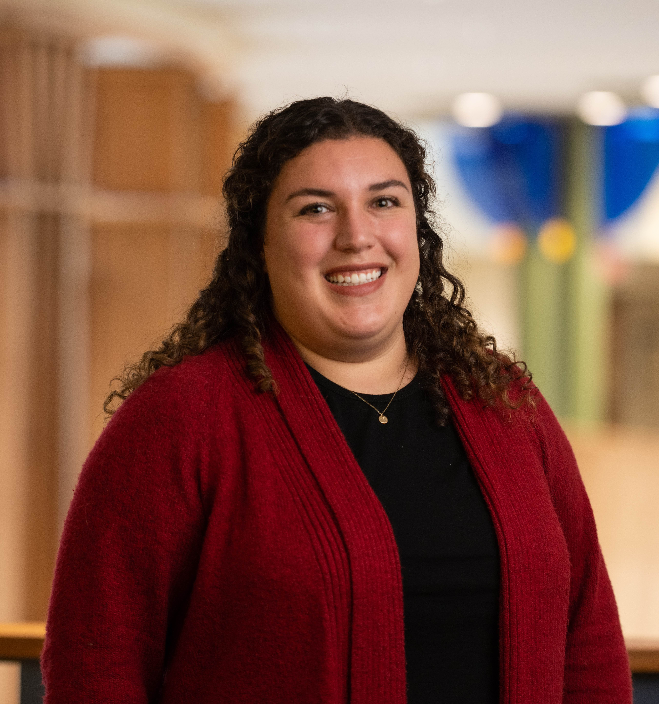

::: columns
::: {.column width="68%"}
-   **Email:** [wakim\@ohsu.edu](mailto:wakim@ohsu.edu)

-   **Office:** VPT 622A

**Pronouns:** she/her/hers

*You are welcome to address me as Nicky (pronounced "NIH-kee"), Dr. Wakim (pronounced "wah-KEEM"), Dr. W, Dr. Nicky, Professor, Professor Wakim, or any combination of the prior.*

**Best method to contact:** Office hours or email for general course questions.
:::

::: {.column width="2%"}
:::

::: {.column width="30%"}
{fig-align="right" width="256"}
:::
:::

**Brief professor statement:** As a professor, my main goal is to instill a growth mindset into my students. Growth mindset means we are NOT stuck in our abilities or knowledge, and that we all can grow with effort, feedback, and learning from mistakes! This course aims to be as transparent as possible. I want you to understand my motivation for assessments, questions, and lessons. I also want those assessments to be clear, so please ask for clarification whenever needed.

## Office Hours

| **Day**    | **Time**               | **Who**   | **Link**                                            |
|:-----------|:-----------------------|:----------|:----------------------------------------------------|
| Tuesdays   | 11:30 AM - 12:30 PM PT | Nicky     | [Webex](https://ohsu.webex.com/meet/wakim)          |
| Wednesdays | 3:15 - 4:15 PM PT      | Madi (TA) | [Zoom](https://pdx.zoom.us/j/88334628156)           |
| Thursdays  | 3:00 - 4:00 PM PT      | Madi (TA) | [Zoom](https://pdx.zoom.us/j/85361724787)           |

You don't need to stay for the whole hour. Drop in for whatever part works for you! If none of these times work, email me and we'll figure something out.
