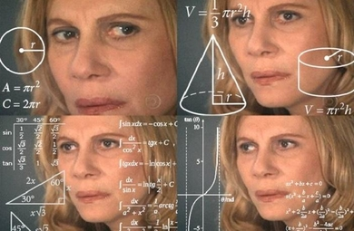

```{r setup, include=FALSE}
library(here)
source(here("class_dates.R"))

library(tidyverse)
```

# Learning Objectives

1.  Use simulations (e.g., coin flips in R) to illustrate randomness in equally likely outcomes.

2.  Identify sample spaces and events for basic experiments, and define probability calculations.

## Where are we?

- Big part of this lesson is **motivating** why we care about probability and simulations, then we'll dive into **some basics**

{fig-align="center"}

## What is probability? (1/2)

- We hear the word "probability" pretty often
  - Common in news reports, advertisements, sports, medicine, etc.

> Researchers say the *probability* of living past 110 is on the rise
>
> [CNBC, 2021](https://www.cnbc.com/2021/07/17/study-living-past-110-is-becoming-more-likely-longevity-tips.html)

- We may hear "probability" or similar words like "chance," "likelihood," or "odds"

> Scientists fine-tune *odds* of asteroid Bennu hitting Earth through 2300 with NASA probe’s help
>
> [Space.com, 2021](https://www.space.com/asteroid-bennu-osiris-rex-impact-odds)

## Before we take one more step

- The following few slides *use some undefined words* to **define new words** that in turn *define the previously undefined words*
- It's confusing!
- We're going off assumption that we all have some daily understanding of probability, so stop me if you are confused!

{fig-align="center"}

# Learning Objectives

::: lob
1.  Use simulations (e.g., coin flips in R) to illustrate randomness in equally likely outcomes.
:::

2.  Identify sample spaces and events for basic experiments, and define probability calculations.

## Probability and randomness

- Probability requires [**randomness**]{style="color:#29abe0;"}

- Something is [**random**]{style="color:#29abe0;"} if there are many potential **outcomes**, but there is [**uncertainty**]{style="color:#E89543;"} which **outcome** will occur

 

- **Outcomes** can be ["equally likely,"]{style="color:#d9534f;"} meaning each **outcome** has the *same* probability of happening
  - But [**random**]{style="color:#29abe0;"} does **NOT** necessarily mean [equally likely]{style="color:#d9534f;"}
- We often use physical randomness to demonstrate [equally likely]{style="color:#d9534f;"} outcomes
  - Think: flipping coins, rolling a dice, drawing cards

 

- The occurrence of outcomes can be [**uncertain**]{style="color:#E89543;"}, but there is an **underlying distribution of the probability** of outcomes
  - There is a distribution of outcomes over large number of (hypothetical repetitions)

## A single coin flip then 100 coin flips

[Seeing Theory, Chapter 1: Basic Probability, Chance Events](https://seeing-theory.brown.edu/basic-probability/index.html)

```{css, echo = FALSE}
#wrap { width: 600px; height: 390px; padding: 0; overflow: hidden; }
#frame { width: 1300px; height: 600px; border: 1px solid black; }
#frame { zoom: 1.5; -moz-transform: scale(1.5); -moz-transform-origin: 0 0; }
```

```{=html}
<iframe id="frame" src="https://seeing-theory.brown.edu/basic-probability/index.html"></iframe>
```

## How do we simulate this in R?

- We know that heads and tails are [equally likely]{style="color:#d9534f;"} for a single flip

```{r}
set.seed(13) #<1>
coin <- c("heads", "tails") #<2>
sample(coin, 1) #<3>
```

1. We need to set a seed, to hold our place in the randomness in R.
2. We set our two options for our coin toss.
3. We then sample the coin (flip it) one time. 

- When we only flip the coin once, we only get one outcome (heads or tails)
  - We cannot see any distribution of the probability of outcomes

## What if I sample 10 coin flips?

- How many heads do we get? Are we getting closer to a distribution of heads and tails that we expect?

```{r sim-flips, echo = FALSE}
# Four independent sequences of 1000 fair coin flips (one row per flip),
# with the running count and running proportion of heads in each sequence
n_flips <- 1000

flips <- expand_grid(set = 1:4, flip = 1:n_flips) |>
  mutate(result = sample(c("H", "T"), n(), replace = TRUE)) |>
  group_by(set) |>
  mutate(
    heads_count = cumsum(result == "H"),
    prop_heads  = heads_count / flip
  ) |>
  ungroup()
```

```{r coin-flips-table, echo = FALSE}
flips |>
  filter(set == 1, flip <= 10) |>
  select(flip, result, heads_count, prop_heads) |>
  knitr::kable(
    align = "r",
    col.names = c("Flip", "Result",
                  "Running count of H",
                  "Running proportion of H"),
    digits = 3,
    booktabs = TRUE,
    caption = "Results and running proportion of H for 10 flips of a fair coin."
  )
```

## What if I sample 100 coin flips?

```{r coin-flips-plot, echo = FALSE}
flips |>
  filter(set == 1, flip <= 100) |>
  ggplot(aes(x = flip, y = prop_heads)) +
  geom_line() +
  geom_point() +
  geom_hline(yintercept = 0.5, linetype = "dotted") +
  scale_y_continuous(limits = c(0, 1)) +
  theme_classic(base_size = 16) +
  labs(
    x = "Flip number",
    y = "Running proportion of H"
  )
```

## What's the point?

- We know the probability of a heads is 0.5!

 

- Why do we need to simulate 100s or 1000s of coin flips?
  - With enough repetitions, we can **use simulations to approximate the probability of an event**

 

- Okay, but why is that helpful? (next slide!)

## Why are simulations important? (bigger picture)

In the previous example, coding a simulation seemed more educational than necessary

 

1.  Simulations can help us (or be necessary) to **solve a problem when calculations are complex**

    - We can often calculate probabilities mathematically, but we will eventually get to complex calculations

2.  Simulations are a great way to **check your work**!

3.  Simulation based **reasoning** is helpful in statistics

    - You'll see this in confidence intervals in Biostatistics courses

4.  Simulations allow you to **change assumptions easily** and see how they affect your results

5.  It is often **how statisticians "run" experiments** on their methods of hypotheses

# Learning Objectives

1.  Use simulations (e.g., coin flips in R) to illustrate randomness in equally likely outcomes.

::: lob
2.  Identify sample spaces and events for basic experiments, and define probability calculations.
:::

## Outcomes, events, sample spaces

::::: definition
::: def-title
Definition: Outcome
:::

::: def-cont
The possible results in a random phenomenon.
:::
:::::

::::: definition
::: def-title
Definition: Sample Space
:::

::: def-cont
The **sample space** $S$ is the set of *all* outcomes
:::
:::::

::::: definition
::: def-title
Definition: Event
:::

::: def-cont
An **event** is a *collection of some* outcomes. An event can include multiple outcomes or no outcomes (a subset of the sample space).
:::
:::::

When thinking about events, think about outcomes that you might be asking the probability of. For example, what is the probability that you get a heads or a tails in one flip? (Answer: 1)

## Coin Toss Example: 1 coin (1/3)

::::::: columns
:::::: column
::::: example
::: ex-title
Single coin toss
:::

::: ex-cont
**Suppose you toss one coin.**

- What are the possible outcomes?

   

- What is the sample space?

   

- What are the possible events?
:::
:::::
::::::
:::::::

## Coin Toss Example: 1 coin (2/3)

**Suppose you toss one coin.**

- What are the possible outcomes?

  - Heads ($H$)

  - Tails ($T$)

 

::::: fact
::: fact-title
Note
:::

::: fact-cont
When something happens at random, such as a coin toss, there are several possible outcomes, and *exactly one* of the outcomes will occur.
:::
:::::

## Coin Toss Example: 1 coin (3/3)

::::::::::: columns
::: {.column width="60%"}
- What is the sample space?

  - $S =$

 

 

- What are the possible events?

  - 
  
   

  - 
  
   

  - 
  
   

  - 

   
:::

::::::::: {.column width="40%"}
::::: fact
::: fact-title
Note #1
:::

::: fact-cont
We use curly brackets ($\{\}$) to denote a set (collecting a list of outcomes or values)
:::
:::::

::::: fact
::: fact-title
Note #2
:::

::: fact-cont
The total number of possible events is $$2^{|S|}$$ where $|S|$ is the total number of outcomes in the sample space. Also, possible events are not necessarily something that can actually occur (i.e. getting a heads and a tails on a single coin flip)
:::
:::::
:::::::::
:::::::::::

## Coin Toss Example: 2 coins

**Suppose you toss two coins.**

- What is the sample space? *Assume the coins are distinguishable*

  - $S =$

 

- What are some possible events?

  - $A =$ exactly one $H =$
  
   

  - $B =$ at least one $H =$
  
   

  - 
  
   

  - 

## More info on events and sample spaces

- We usually use capital letters from the beginning of the alphabet to denote events. However, other letters might be chosen to be more descriptive.
  - Examples: $A, B, C, A_1, A_2$
- We can also define a new event as a combination of other events (**next lesson**)
  - Examples: $A \cup B$ (union), $A \cap B$ (intersection), $A^C$ (complement)

 

- We use the notation $|S|$ to denote the **size** of the sample space.

 

- The total number of possible events is $2^{|S|}$, which is the total number of possible subsets of $S$.

 

- The **empty set**, denoted by $\emptyset$, is the set containing no outcomes.

## Example: Keep sampling until... {visibility="hidden"}

**Suppose you keep sampling people until you have someone with high blood pressure (BP)**

 

**What is the sample space?**

- Let $H =$ denote someone with high BP.

- Let $H^C =$ denote someone with not high blood pressure, such as low or regular BP.

 

- Then, $S =$

## Let's define probability with events and spaces

If $S$ is a finite sample space, with [**equally likely**]{style="color:#d9534f;"} **outcomes**, then

$$\mathbb{P}(A) = \frac{|A|}{|S|}$$

In human speak:

- For [**equally likely**]{style="color:#d9534f;"} **outcomes**, the probability that a certain event occurs is: the number of outcomes within the event of interest ($|A|$) **divided by** the total number of possible outcomes ($|S|$)

$$\mathbb{P}(A) = \frac{\text{total number of outcomes in event A}}{\text{total number of outcomes in sample space}}$$

- Thus, it is important to be able to count the outcomes within an event

## A probability is a function...

- $\mathbb{P}(A)$ is a function with

  - **Input:** event $A$ from the sample space $S$, ($A \subseteq S$)

    - $A \subseteq S$ means "A contained within S" or "A is a subset of S"

  - **Output:** a number between 0 and 1 (inclusive)

 

- The [**probability function**]{style="color:#E25D3B;"} maps an event (input) to value between 0 and 1 (output)

  - When we speak of the probability function, we often call the values between 0 and 1 "probabilities"

    - Example: "The probability of drawing a heart is 0.25" for $P(\text{heart}) = 0.25$

 

- The probability function needs to follow some specific rules (called axioms)!

## Coin Toss Example Revisited: 2 coins

- From our sample space and events:
  - Sample space: $S = \{HH, HT, TH, TT\}$

  - Event A: $A = \text{exactly one H} = \{HT, TH\}$

  - Event B: $B = \text{at least one H} = \{HT, TH, HH\}$

 

- Calculate $P(A)$ and $P(B)$

# Learning Objectives

1.  Use simulations (e.g., coin flips in R) to illustrate randomness in equally likely outcomes.

2.  Identify sample spaces and events for basic experiments, and define probability calculations.
