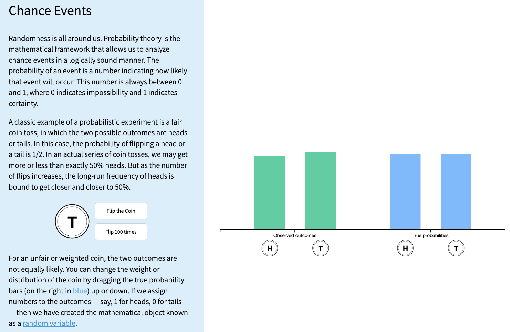

```{r setup, include=FALSE}
library(here)
library(tidyverse)

source(here("class_dates.R"))
```

# Learning Objectives

1. Describe random variables and distinguish between discrete and continuous types
2. Explain the role of simulation in approximating probabilities and distributions
3. Use R to run simulations of discrete random variables
4. Apply and interpret the four-step simulation process

## Where are we?

{fig-align="center"}

# Learning Objectives

::: lob
1. Describe random variables and distinguish between discrete and continuous types
:::

2. Explain the role of simulation in approximating probabilities and distributions
3. Use R to run simulations of discrete random variables
4. Apply and interpret the four-step simulation process

## Recall: Outcomes, events, sample spaces

::::: definition
::: def-title
Definition: Outcome
:::

::: def-cont
The possible results in a random phenomenon.
:::
:::::

::::: definition
::: def-title
Definition: Sample Space
:::

::: def-cont
The **sample space** $S$ is the set of *all* outcomes
:::
:::::

::::: definition
::: def-title
Definition: Event
:::

::: def-cont
An **event** is a *collection of some* outcomes. An event can include multiple outcomes or no outcomes (a subset of the sample space).
:::
:::::

When thinking about events, think about outcomes that you might be asking the probability of. For example, what is the probability that you get a heads or a tails in one flip? (Answer: 1)

## We need to understand random variables 

::: definition
::: def-title
Definition: Random Variable
:::

::: def-cont
For a given sample space $S$, a **random variable** (r.v.) is a **function** whose domain is $S$ and whose range is the set of real numbers $\mathbb{R}$. **A random variable assigns a real number to each outcome in the sample space.**
:::
:::

-   A random variable's value is completely determined by the outcome $\omega$, where $\omega \in S$

    -   What is *random* is the outcome $\omega$

-   A [**random variable**]{style="color:#29abe0;"} is a function from the sample space (with outcomes $\omega$) to the set of real numbers

    -   We typically write $X(\omega)$ (or $X$ for short), where $X$ is our random variable
    
- Thus, we can take our sample space (all outcomes) and make functional transformations to it

## The cool (and tricky) thing about random variables

Do you remember our coin example from Lesson 1? We tossed one or two coins.

- For each coin, the **sample space** is heads and tails ($S = \{H,T\}$)
- If we want the **sample space** for both coins in order, then we have combinations ($S=\{(H,H), (H,T), (T,H), (T,T)\}$)

 

We make the [**random variable**]{style="color:#29abe0;"} a *function* of the **sample space**.

- For one coin toss, we can say random variable $X$ is $1$ if we toss a heads ($\omega = \text{H}$) and $X=0$ if we get a tails
- For the two coins, we can say $X$ is the count of heads, so if $\omega = \text{(H, T)}$, then $X=1$
    
## Types of random variables

There are two types of random variables:

::: columns
::: column

::: theorem
::: thm-cont
-   [**Discrete random variables** (RVs)]{style="color:#20c997;"}: the set of possible values is either finite or can be put into a countably infinite list

    -   You could *theoretically* list the specific possible outcomes that the variable can take

    -   If you sum the rolls of three dice, you must get a whole number. For example, you can't get any number between 3 and 4.
:::
:::

:::
::: column

::: axiom
::: axiom-cont
-   [**Continuous random variables** (RVs)]{style="color:#d9534f;"}: take on values from continuous *intervals*, or unions of continuous intervals

    -   Variable takes on a range of values, but there are infinitely possible values within the range

    -   If you keep track of the time you sleep, you can sleep for 8 hours or 7.9 hours or 7.99 hours or 7.999 hours ...
:::
:::
:::
:::

-   [**Discrete random variables**]{style="color:#20c997;"} (RVs) are a little easier to simulate right now
    - We will only do discrete RVs today

# Learning Objectives 

1. Describe random variables and distinguish between discrete and continuous types

::: lob
2. Explain the role of simulation in approximating probabilities and distributions
:::

3. Use R to run simulations of discrete random variables
4. Apply and interpret the four-step simulation process

## What is a simulation?

A **probability model** for a random phenomenon includes a sample space, events, random variables, and a probability measure.

::::: definition
::: def-title
Simulation
:::

::: def-cont
[**Simulation**]{style="color:#006a4e;"} involves using a probability model to artificially recreate a random phenomenon, many times, usually using a computer.
:::
:::::

We simulate outcomes and values of random variables according to the model's assumptions.

## The Foundation: Relative Frequencies

-   Probabilities can be interpreted as [**long-run relative frequencies**]{style="color:#E89543;"}

 

-   By simulating a random phenomenon a large number of times, we can approximate the probability of an event by calculating the relative frequency of its occurrence
    - Basically, out of all the trials we run, how many times did the event happen?

 

-   Simulation is a powerful tool to **approximate a few things**:
    - Probabilities
    - Distributions of random variables
    - Long-run averages

## We saw an example of long-run relative frequency in our coin flip 

In Lesson 1, we flipped a coin 100 times and recorded the proportion of heads.

- We tossed 50 heads out of the 100 flips
- Our [**long-run relative frequency**]{style="color:#E89543;"} was $50/100 = 0.5$, which **approximated the probability** of getting a head on any one flip

```{r sim-flips}
#| echo: false
#| output: false

# Same seed and code as Lesson 1, so this plot matches the one students saw
set.seed(13)
coin <- c("heads", "tails")
sample(coin, 1)

n_flips <- 1000

flips <- expand_grid(set = 1:4, flip = 1:n_flips) |>
  mutate(result = sample(c("H", "T"), n(), replace = TRUE)) |>
  group_by(set) |>
  mutate(
    heads_count = cumsum(result == "H"),
    prop_heads  = heads_count / flip
  ) |>
  ungroup()
```

::: columns
::: {.column width="30%"}
{fig-align="center"}
:::
::: {.column width="70%"}
```{r coin-flips-plot, echo = FALSE}
#| fig-width: 13
#| fig-height: 7

flips |>
  filter(set == 1, flip <= 100) |>
  ggplot(aes(x = flip, y = prop_heads)) +
  geom_line() +
  geom_point(size = 2) +
  geom_hline(yintercept = 0.5, linetype = "dotted") +
  scale_y_continuous(limits = c(0, 1)) +
  theme_classic(base_size = 20) +
  labs(
    x = "Flip number",
    y = "Running proportion of H"
  )
```

:::
:::

## Tactile simulations

-   We've already seen coin flips!
-   We can also use cards, dice, and other objects to simulate discrete random variables

 

-   Other common method: A **box model** uses a box/hat/bucket of "tickets" with labels to represent possible outcomes
    -   Allows us to increase the number of "tickets" with appropriate labels
    -   **Coin flip as box model:** A box with two tickets (H and T).
    -   **90% free throw shooter:** A box with 10 tickets (9 "make" and 1 "miss").
    -   Draws can be **with replacement** (e.g., coin flips) or **without replacement** (e.g., dealing a poker hand).

# Learning objectives

1. Describe random variables and distinguish between discrete and continuous types
2. Explain the role of simulation in approximating probabilities and distributions

::: lob
3. Use R to run simulations of discrete random variables
:::

4. Apply and interpret the four-step simulation process

## Example to build our simulation skills

::::: example
::: ex-title
Example: Simulating Two Rolls of a Fair Four-Sided Die
:::

::: ex-cont
We're going to roll two four-sided dice. Let $X$ be the sum of two rolls, and $Y$ be the larger of the two rolls. How would we simulate $X$ and $Y$ separately?
:::
:::::

 

- Note: this example is not asking for a probability!
    - We can simulate a random variable and look at its distribution without calculating any probabilities.

 

- We will focus on simulating $X$ first

 

Let's build up some coding tools to do this!

## How do we simulate something like a **single** roll of a die?

-   We can also use `R` to sample from the box or spinner

-   The `sample()` function is a powerful tool for simulating draws from a box model.

-   For example, we can simulate a coin flip

      - What is `x`?
      - What is `size`?

```{r}
sample(x = c("H", "T"), size = 1) # <1>
```

1. `sample()` draws at random from the values in `x`. `c("H", "T")` puts "H" and "T" together as a box of two tickets, and `size = 1` draws one ticket.

 

- Or a roll of a four-sided die

```{r}
sample(x = c(1, 2, 3, 4), size = 1) # <1>
```

1. Same idea for a four-sided die: the box has tickets 1, 2, 3, and 4, and we draw one.

## What if we have multiple rolls at once?

- We can set `size` to be larger than 1 to simulate multiple draws at once

```{r}
sample(x = c("H", "T"), size = 5, replace = TRUE) # <1>
```

1. `size = 5` draws 5 tickets. `replace = TRUE` puts each ticket back before the next draw, so "H" and "T" can come up again, just like flipping the same coin 5 times.

-   We can simulate our example of the two four-sided dice

```{r}
sample(x = c(1, 2, 3, 4), size = 2, replace = TRUE) # <1>
```

1. Two rolls of a four-sided die. Because of `replace = TRUE`, both rolls can show the same number.

 

- What happens if we set `replace = FALSE`?

```{r}
sample(x = c(1, 2, 3, 4), size = 2, replace = FALSE) # <1>
sample(x = c(1, 2, 3, 4), size = 4, replace = FALSE) # <2>
```

1. Without replacement, a ticket cannot be drawn twice, so the two numbers are always different.
2. Drawing all 4 tickets without replacement just shuffles 1, 2, 3, and 4.

## Can we start to simulate many rolls of two dice?

::::: example
::: ex-title
Example: Simulating Two Rolls of a Fair Four-Sided Die
:::

::: ex-cont
We're going to roll two four-sided dice. Let $X$ be the sum of two rolls, and $Y$ be the larger of the two rolls. How would we simulate $X$ and $Y$ separately?
:::
:::::

- To repeat our pair of rolls many times, we make a **table with one row for every roll**
    - `sim` numbers each simulation (each pair of rolls), and `die` says which die was rolled
    - `expand_grid()` makes every combination of `sim` and `die`, and `n()` is the number of rows

 

- Let's start with 5 simulations

```{r}
reps <- 5 # <1>

rolls <- expand_grid(sim = 1:reps, die = 1:2) |> # <2>
  mutate(roll = sample(1:4, n(), replace = TRUE)) # <3>
```

1. Save the number of simulations as `reps`, so it is easy to change later.
2. Make a table with every combination of simulation number (1 to 5) and die number (1 or 2), which gives 10 rows. The pipe `|>` passes this table to the next line.
3. `mutate()` adds a new column called `roll`. `n()` is the number of rows (10), so we get one random roll of a four-sided die for every row.

## What does our table of rolls look like?

::: columns
::: {.column width="40%"}

```{r}
rolls # <1>
```

1. Typing the name of a saved object prints it.

:::
::: {.column width="60%"}

 

- Each row is **one roll of one die**

 

- Each simulation (`sim`) takes up **two rows**: one for `die` 1 and one for `die` 2
    - For example, the two rows with `sim` = 1 are the first pair of rolls

 

- Next, we combine the two rolls in each simulation to get $X$

:::
:::

## Then we calculate $X$ for each simulation

- $X$ is the sum of the two rolls, so we add up the rolls **within each simulation**
    - `group_by(sim)` tells R to treat each simulation separately
    - `summarise()` collapses each group into one row

```{r}
rolls |> # <1>
  group_by(sim) |> # <2>
  summarise(X = sum(roll)) # <3>
```

1. Start with the table of rolls and pass it to the next line.
2. Group the rows by simulation, so each pair of rolls is handled separately.
3. Add up the rolls in each simulation. This makes one row per simulation, with the sum saved in a new column called `X`.

 

- Now we have **one row per simulation** and one value of $X$ in each row

## We need more reps for long-run relative frequencies

::: columns
::: {.column width="60%"}

- Same code, but now with 10,000 simulations

```{r}
reps <- 10000 # <1>

rolls <- expand_grid(sim = 1:reps, die = 1:2) |> # <2>
  mutate(roll = sample(1:4, n(), replace = TRUE)) # <2>

X_sims <- rolls |> # <3>
  group_by(sim) |> # <3>
  summarise(X = sum(roll)) # <3>
```

1. The only change: 10,000 simulations instead of 5.
2. Same as before: one row per roll (now 20,000 rows), each with a random roll.
3. Same as before: add up the rolls in each simulation. We save the result as `X_sims`.

:::
::: {.column width="40%"}

- Let's look at the first few simulations

```{r}
X_sims # <1>
```

1. A tibble (table) only prints its first 10 rows, followed by a note saying how many rows are left.

:::
:::

## We can look at the plot of random variable $X$

```{r}
#| echo: false
#| fig-width: 16
#| fig-height: 8

ggplot(X_sims, aes(x = X, y = after_stat(prop))) +
  geom_bar(color = "black", fill = "lightblue") +
  scale_x_continuous(breaks = 2:8) +
  labs(title = "Simulated Distribution of X (Sum of Two Rolls)",
       x = "Value of X",
       y = "Relative frequency") +
  theme_minimal(base_size = 20)
```

## If we want to calculate something else, we can!

::: columns
::: {.column width="60%"}

- `summarise()` can calculate several summaries at once:
    - Average and standard deviation of $X$
    - Probability that $X = 5$ and probability that $X < 3$

```{r}
X_sims |> # <1>
  summarise( # <2>
    average     = mean(X), # <3>
    std_dev     = sd(X), # <3>
    prob_5      = mean(X == 5), # <4>
    prob_less_3 = mean(X < 3) # <4>
  )
```

1. Start with the 10,000 simulated values of `X`.
2. `summarise()` collapses the whole table into one row. Each name inside it becomes a column.
3. The average and standard deviation of the simulated values of `X`.
4. `X == 5` and `X < 3` are `TRUE` or `FALSE` for each simulation, so their mean is the proportion of simulations where the event happened.

:::
::: {.column width="40%"}

 

::: proof1
::: proof-cont
Probabilities ([**relative frequencies**]{style="color:#E89543;"}) are the **proportion of simulations** where the event occurs:

- `X == 5` is `TRUE` or `FALSE` for each simulation
- R treats `TRUE` as 1 and `FALSE` as 0, so `mean(X == 5)` is the number of times the event occurs divided by the total number of simulations (reps)
:::
:::
:::
:::

# Learning objectives

1. Describe random variables and distinguish between discrete and continuous types
2. Explain the role of simulation in approximating probabilities and distributions
3. Use R to run simulations of discrete random variables

::: lob
4. Apply and interpret the four-step simulation process
:::

## 4 (S)teps of a Simulation

::::: proposition
::: prop-title
1.  Set up
:::

::: prop-cont
Define the probability space and related random variables and events, including assumptions.
:::
:::::

::::: proof1
::: proof-title
2.  Simulate
:::

::: proof-cont
Run the simulation to generate outcomes according to the assumptions.
:::
:::::

::::: example
::: ex-title
3.  Summarize
:::

::: ex-cont
Analyze the output using plots and summary statistics like relative frequencies and averages.
:::
:::::

::::: extra
::: ext-title
4.  Sensitivity analysis
:::

::: ext-cont
Investigate how results change when assumptions or parameters of the model are altered.
:::
:::::

## Example: Dice Rolls

::::: example
::: ex-title
Example: Simulating Two Rolls of a Fair Four-Sided Die
:::

::: ex-cont
We're going to roll two four-sided dice. Let $X$ be the sum of two rolls, and $Y$ be the larger of the two rolls. How would we simulate $X$ and $Y$ separately?
:::
:::::

- Use the steps to run simulation for $Y$ now

##

::::: proposition
::: prop-title
1.  Set up
:::

::: prop-cont
Define the probability space and related random variables and events, including assumptions.
:::
:::::

- [**Random variable:**]{style="color:#29abe0;"} $Y(\omega)$ is the larger of the two rolls in outcome $\omega$
- **Goal:** simulate $Y$, the larger of two rolls of a fair four-sided die
- **Sample space:** all possible outcomes of rolling two four-sided dice
    - Not necessary, but helpful to define the sample space

$$\begin{aligned} S =  \{ &(1,1), (1,2), (1,3), (1,4), (2,1), (2,2), (2,3), (2,4),\\ & (3,1), (3,2), (3,3), (3,4), (4,1), (4,2), (4,3), (4,4)\} \end{aligned}$$

- **Assumptions:** each die is fair and rolls are independent
  - Each outcome in $S$ is equally likely with probability $1/16$

##

::::: proof1
::: proof-title
2.  Simulate
:::

::: proof-cont
Run the simulation to generate outcomes according to the assumptions.
:::
:::::

- Same code as for $X$, but we take the `max()` of each simulation instead of the `sum()`
- We also save the number of dice as `n_dice`, so it is easy to change later

```{r}
reps <- 10000 # <1>
n_dice <- 2 # <1>

rolls <- expand_grid(sim = 1:reps, die = 1:n_dice) |> # <2>
  mutate(roll = sample(1:4, n(), replace = TRUE)) # <2>

Y_sims <- rolls |> # <3>
  group_by(sim) |> # <3>
  summarise(Y = max(roll)) # <3>
```

1. Save the settings for the simulation: 10,000 simulations with 2 dice each.
2. Same as for `X`: one row per roll, with a random roll of a four-sided die in each row.
3. The only change from `X`: `max()` keeps the larger roll in each simulation instead of adding them up.

 

- We can look at the first 30 simulations
```{r}
head(Y_sims$Y, 30) # <1>
```

1. `Y_sims$Y` pulls out the `Y` column, and `head(..., 30)` shows its first 30 values.

##

::::: example
::: ex-title
3.  Summarize
:::

::: ex-cont
Analyze the output using plots and summary statistics like relative frequencies and averages.
:::
:::::

::: columns
::: {.column width="55%"}

```{r}
#| code-fold: true
#| code-summary: "Show/Hide Code for plotting Y"
#| fig-width: 11
#| fig-height: 6

ggplot(Y_sims, aes(x = Y, y = after_stat(prop))) + # <1>
  geom_bar(color = "black", fill = "#B3C8BF") + # <2>
  scale_x_continuous(breaks = 1:4) + # <3>
  labs(title = "Simulated Distribution of Y (Larger of Two Rolls)", # <4>
       x = "Value of Y", # <4>
       y = "Relative frequency") + # <4>
  theme_minimal(base_size = 20) # <5>
```

1. Start a plot of `Y_sims` with `Y` on the x-axis. `after_stat(prop)` makes each bar's height a proportion (relative frequency) instead of a count. Layers are added with `+`.
2. Draw one bar for each value of `Y`, with a black outline.
3. Put tick marks at 1, 2, 3, and 4.
4. Add a title and axis labels.
5. Use a simple theme with larger text so the plot is readable on slides.

:::
::: {.column width="45%"}

If the problem asked us for something else, we could compute it:

- Average of $Y$
- Probability that $Y = 1$
- Probability that $Y > 3$

```{r}
Y_sims |> # <1>
  summarise( # <1>
    average     = mean(Y), # <2>
    prob_1      = mean(Y == 1), # <3>
    prob_over_3 = mean(Y > 3) # <3>
  )
```

1. Collapse the 10,000 simulated values of `Y` into one row of summaries.
2. The average of `Y`.
3. The proportion of simulations where `Y = 1` and where `Y > 3`. These approximate the probabilities.

:::
:::

##

::::: extra
::: ext-title
4.  Sensitivity analysis
:::

::: ext-cont
Investigate how results change when assumptions or parameters of the model are altered.
:::
:::::

What if we rolled three dice instead of two?

- We only need to change `n_dice`! Everything else stays the same (the changed line is highlighted)

```{r}
#| code-line-numbers: "2"
reps <- 10000 # <1>
n_dice <- 3 # <2>

rolls <- expand_grid(sim = 1:reps, die = 1:n_dice) |> # <3>
  mutate(roll = sample(1:4, n(), replace = TRUE)) # <3>

Y_sims <- rolls |> # <3>
  group_by(sim) |> # <3>
  summarise(Y = max(roll)) # <3>
```

1. Still 10,000 simulations.
2. The only change: roll 3 dice in each simulation instead of 2.
3. Exactly the same code as before. Because we wrote `n_dice` instead of typing 2, each simulation now gets three rows automatically.

## 

::::: extra
::: ext-title
4.  Sensitivity analysis
:::

::: ext-cont
Investigate how results change when assumptions or parameters of the model are altered.
:::
:::::

::: columns
::: {.column width="45%"}

- What changed? Each simulation now has **three rolls**, like the first one here:

```{r}
rolls |> filter(sim == 1) # <1>
```

1. `filter()` keeps only the rows that match a condition. Here, that is the three rolls from simulation 1.

 

- With more dice, it is more likely that **at least one** die shows a 4
    - $P(Y = 4)$ goes from about 0.44 with two dice to about 0.58 with three dice

:::
::: {.column width="55%"}

```{r}
#| code-fold: true
#| code-summary: "Show/Hide Code for plotting Y"
#| fig-width: 11
#| fig-height: 6

ggplot(Y_sims, aes(x = Y, y = after_stat(prop))) + # <1>
  geom_bar(color = "black", fill = "#B3C8BF") + # <2>
  scale_x_continuous(breaks = 1:4) + # <3>
  labs(title = "Simulated Distribution of Y (Larger of Three Rolls)", # <4>
       x = "Value of Y", # <4>
       y = "Relative frequency") + # <4>
  theme_minimal(base_size = 20) # <5>
```

1. Start a plot of `Y_sims` with `Y` on the x-axis. `after_stat(prop)` makes each bar's height a proportion (relative frequency) instead of a count. Layers are added with `+`.
2. Draw one bar for each value of `Y`, with a black outline.
3. Put tick marks at 1, 2, 3, and 4.
4. Add a title and axis labels.
5. Use a simple theme with larger text so the plot is readable on slides.

:::
:::

# Learning Objectives

1. Describe random variables and distinguish between discrete and continuous types
2. Explain the role of simulation in approximating probabilities and distributions
3. Use R to run simulations of discrete random variables
4. Apply and interpret the four-step simulation process
