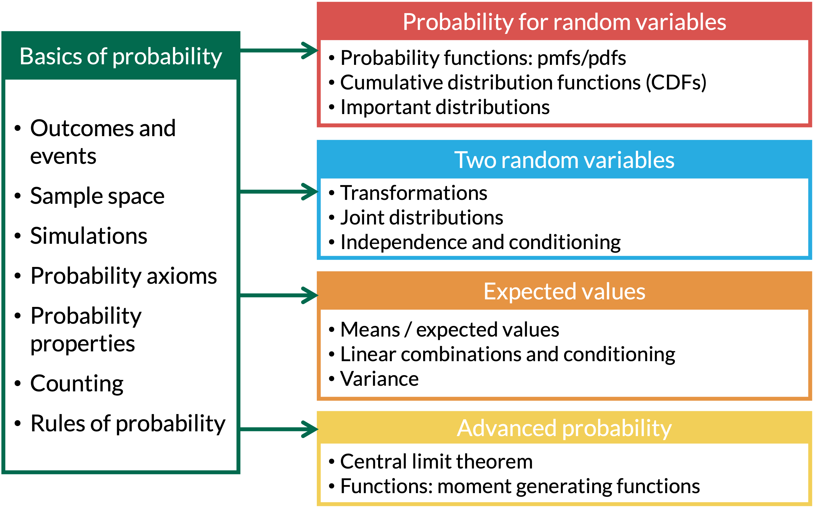

```{r setup, include=FALSE}
pacman::p_load(
  here, 
  tidyverse
  )
source(here("class_dates.R"))
```

# Learning Objectives

1.  Use set notation, Venn diagrams, and the concepts of unions, intersections, complements, and mutually exclusive events to represent and describe events.

2.  Apply the axioms of probability and related properties to calculate probabilities and prove simple results.

3.  Explain and use De Morgan’s Laws to simplify and solve probability problems.

4.  Connect partitions and all rules of probability to calculate probabilities.

## Where are we?

{fig-align="center"}

# Learning Objectives

::: lob
1.  Use set notation, Venn diagrams, and the concepts of unions, intersections, complements, and mutually exclusive events to represent and describe events.
:::

2.  Apply the axioms of probability and related properties to calculate probabilities and prove simple results.

3.  Explain and use De Morgan’s Laws to simplify and solve probability problems.

4.  Connect partitions and all rules of probability to calculate probabilities.

## Set Theory (1/2)

:::::::::: {.columns style="align-items: center;"}
::: {.column width="40%"}
::::: definition
::: def-title
Definition: Union
:::

::: def-cont
The **union** of events $A$ and $B$, denoted by $A \cup B$, contains all outcomes that are in $A$ *or* $B$ or both
:::
:::::
:::

::: {.column width="60%"}
```{=html}
<div style="margin: 30px 0;"><svg viewBox="0 0 300 180" style="width:600px; max-width:100%; height:auto; font-family:Lato, 'Helvetica Neue', Arial, sans-serif" xmlns="http://www.w3.org/2000/svg" role="img"><title>Blank Venn diagram</title><defs><clipPath id="v3000cA"><circle cx="118" cy="92" r="62"/></clipPath><clipPath id="v3000cB"><circle cx="182" cy="92" r="62"/></clipPath></defs><rect x="6" y="6" width="288" height="168" fill="none" stroke="#222" stroke-width="2.5"/><text x="284" y="32" text-anchor="end" font-size="22" font-style="italic" fill="#222">S</text><circle cx="118" cy="92" r="62" fill="none" stroke="#77B751" stroke-width="3"/><circle cx="182" cy="92" r="62" fill="none" stroke="#29abe0" stroke-width="3"/><text x="83.9" y="72.1" text-anchor="middle" font-size="24" font-style="italic" fill="#77B751">A</text><text x="216.1" y="72.1" text-anchor="middle" font-size="24" font-style="italic" fill="#29abe0">B</text></svg></div>
```
:::
::::::::::

:::::::::: {.columns style="align-items: center;"}
::: {.column width="40%"}
::::: definition
::: def-title
Definition: Intersection
:::

::: def-cont
The **intersection** of events $A$ and $B$, denoted by $A \cap B$, contains all outcomes that are both in $A$ *and* $B$.
:::
:::::
:::

::: {.column width="60%"}
```{=html}
<div style="margin: 30px 0;"><svg viewBox="0 0 300 180" style="width:600px; max-width:100%; height:auto; font-family:Lato, 'Helvetica Neue', Arial, sans-serif" xmlns="http://www.w3.org/2000/svg" role="img"><title>Blank Venn diagram</title><defs><clipPath id="v3001cA"><circle cx="118" cy="92" r="62"/></clipPath><clipPath id="v3001cB"><circle cx="182" cy="92" r="62"/></clipPath></defs><rect x="6" y="6" width="288" height="168" fill="none" stroke="#222" stroke-width="2.5"/><text x="284" y="32" text-anchor="end" font-size="22" font-style="italic" fill="#222">S</text><circle cx="118" cy="92" r="62" fill="none" stroke="#77B751" stroke-width="3"/><circle cx="182" cy="92" r="62" fill="none" stroke="#29abe0" stroke-width="3"/><text x="83.9" y="72.1" text-anchor="middle" font-size="24" font-style="italic" fill="#77B751">A</text><text x="216.1" y="72.1" text-anchor="middle" font-size="24" font-style="italic" fill="#29abe0">B</text></svg></div>
```
:::
::::::::::

## Set Theory (2/2)

:::::::::: {.columns style="align-items: center;"}
::: {.column width="40%"}
::::: definition
::: def-title
Definition: Complement
:::

::: def-cont
The **complement** of event $A$, denoted by $A^C$ or $A'$, contains all outcomes in the sample space $S$ that are *not* in $A$ .
:::
:::::
:::

::: {.column width="60%"}
```{=html}
<div style="margin: 30px 0;"><svg viewBox="0 0 300 180" style="width:600px; max-width:100%; height:auto; font-family:Lato, 'Helvetica Neue', Arial, sans-serif" xmlns="http://www.w3.org/2000/svg" role="img"><title>Blank Venn diagram</title><defs><clipPath id="v3002cA"><circle cx="118" cy="92" r="62"/></clipPath><clipPath id="v3002cB"><circle cx="182" cy="92" r="62"/></clipPath></defs><rect x="6" y="6" width="288" height="168" fill="none" stroke="#222" stroke-width="2.5"/><text x="284" y="32" text-anchor="end" font-size="22" font-style="italic" fill="#222">S</text><circle cx="118" cy="92" r="62" fill="none" stroke="#77B751" stroke-width="3"/><circle cx="182" cy="92" r="62" fill="none" stroke="#29abe0" stroke-width="3"/><text x="83.9" y="72.1" text-anchor="middle" font-size="24" font-style="italic" fill="#77B751">A</text><text x="216.1" y="72.1" text-anchor="middle" font-size="24" font-style="italic" fill="#29abe0">B</text></svg></div>
```
:::
::::::::::

:::::::::: {.columns style="align-items: center;"}
::: {.column width="40%"}
::::: definition
::: def-title
Definition: Mutually Exclusive
:::

::: def-cont
Events $A$ and $B$ are **mutually exclusive**, or disjoint, if they have no outcomes in common. In this case $A \cap B = \emptyset$, where $\emptyset$ is the empty set.
:::
:::::
:::

::: {.column width="60%"}
```{=html}
<div style="margin: 30px 0;"><svg viewBox="0 0 300 180" style="width:600px; max-width:100%; height:auto; font-family:Lato, 'Helvetica Neue', Arial, sans-serif" xmlns="http://www.w3.org/2000/svg" role="img"><title>Blank Venn diagram</title><defs><clipPath id="v3003cA"><circle cx="88" cy="92" r="58"/></clipPath><clipPath id="v3003cB"><circle cx="212" cy="92" r="58"/></clipPath></defs><rect x="6" y="6" width="288" height="168" fill="none" stroke="#222" stroke-width="2.5"/><text x="284" y="32" text-anchor="end" font-size="22" font-style="italic" fill="#222">S</text><circle cx="88" cy="92" r="58" fill="none" stroke="#77B751" stroke-width="3"/><circle cx="212" cy="92" r="58" fill="none" stroke="#29abe0" stroke-width="3"/><text x="56.099999999999994" y="73.9" text-anchor="middle" font-size="24" font-style="italic" fill="#77B751">A</text><text x="243.9" y="73.9" text-anchor="middle" font-size="24" font-style="italic" fill="#29abe0">B</text></svg></div>
```
:::
::::::::::

## How can we code some of these? (1/4)

::::: example
::: ex-title
Example 1: Simulating Two Rolls of a Fair Four-Sided Die
:::

::: ex-cont
We're going to roll two four-sided dice. **This time, let's say event A is rolling matching numbers, event B is rolling at least one 2, and event C is the sum of the dice is 5**
:::
:::::

::: columns
::: {.column width="63%"}
- First, we simulate rolling two four-sided dice. We start small, with only 5 simulations, so we can see every roll

```{r}
set.seed(1022) # <1>
reps <- 5 # <2>
n_dice <- 2
rolls <- expand_grid(sim = 1:reps, die = 1:n_dice) |> # <3>
  mutate(roll = sample(1:4, n(), replace = TRUE)) # <4>
```

1. Set the seed once, so we get the same "random" rolls every time the slides are made.
2. Save the number of simulations and the number of dice as named values, so they are easy to change later.
3. Same setup as Lesson 2: one row for every combination of simulation and die. The pipe `|>` passes the table to the next line.
4. `mutate()` adds a column called `roll`. `n()` is the number of rows, so every row gets one random roll from 1 to 4.
:::

::: {.column width="1%"}
:::

::: {.column width="36%"}
```{r}
rolls # <1>
```

1. Typing a name prints it. Each simulation (`sim`) has two rows, one for each die.
:::
:::

## How can we code some of these? (2/4)

::::: example
::: ex-title
Example 1: Simulating Two Rolls of a Fair Four-Sided Die
:::

::: ex-cont
We're going to roll two four-sided dice. **This time, let's say event A is rolling matching numbers, event B is rolling at least one 2, and event C is the sum of the dice is 5**
:::
:::::

::: columns
::: {.column width="57%"}
- Now, we make one row per simulation, with a `TRUE`/`FALSE` column for each event

```{r}
event_sims <- rolls |> # <1>
  group_by(sim) |> # <2>
  summarise(A = n_distinct(roll) == 1, # <3>
            B = any(roll == 2), # <4>
            C = sum(roll) == 5) # <5>
```

1. Start with `rolls` and save the result as `event_sims`.
2. Group the rows by simulation, so the next line works on the two dice of each simulation together.
3. `n_distinct()` counts the different values. The dice match exactly when there is only 1 distinct value, so `A` is `TRUE` for matching rolls.
4. `roll == 2` checks each die. `any()` is `TRUE` if at least one of them is a 2.
5. `sum()` adds the two dice, and `== 5` checks if the total is 5.
:::

::: {.column width="3%"}
:::

::: {.column width="40%"}
```{r}
event_sims # <1>
```

1. One row per simulation. `TRUE` means the event happened in that simulation.
:::
:::

## How can we code some of these? (3/4)

::: columns

::: {.column width="50%"}

::::: proposition
::: prop-title
Union
:::
::: prop-cont
$A \cup B$  
`A | B`
```{r}
event_sims$A | event_sims$B # <1>
```

1. `$` pulls one column out of a table. `|` means "or": the result is `TRUE` when A happens, B happens, or both.
:::
:::::

::: example
::: ex-title
Complement
:::
::: ex-cont
$A^c$ or $A'$  
`!A`
```{r}
!event_sims$A # <1>
```

1. `!` means "not": it flips every `TRUE` to `FALSE` and every `FALSE` to `TRUE`.
:::
:::

:::

::: {.column width="50%"}

::::: proof1
::: proof-title
Intersection
:::
::: proof-cont
$A \cap B$  
`A & B`
```{r}
event_sims$A & event_sims$B # <1>
```

1. `&` means "and": the result is `TRUE` only when A and B both happen.
:::
:::::

::: extra
::: ext-title
Mutually Exclusive
:::
::: ext-cont
$A \cap C = \emptyset$  
`any(A & C)` is `FALSE`
```{r}
any(event_sims$A & event_sims$C) # <1>
```

1. `A & C` is `TRUE` when the dice match *and* sum to 5. `any()` checks if that ever happens. Matching dice always have an even sum, so it never does: A and C are mutually exclusive.
:::
:::

:::
:::

## How can we code some of these? (4/4)

::::: example
::: ex-title
Example 1: Simulating Two Rolls of a Fair Four-Sided Die
:::

::: ex-cont
We're going to roll two four-sided dice. **This time, let's say event A is rolling matching numbers, event B is rolling at least one 2, and event C is the sum of the dice is 5**
:::
:::::

::: columns
::: {.column width="52%"}
- Same code, now with 10,000 simulations

```{r}
#| code-line-numbers: "1"
reps <- 10000 # <1>
rolls <- expand_grid(sim = 1:reps, die = 1:n_dice) |> # <2>
  mutate(roll = sample(1:4, n(), replace = TRUE))
event_sims <- rolls |>
  group_by(sim) |>
  summarise(A = n_distinct(roll) == 1,
            B = any(roll == 2),
            C = sum(roll) == 5)
```

1. The only change: 10,000 simulations instead of 5.
2. The rest is the same code as before.
:::

::: {.column width="2%"}
:::

::: {.column width="46%"}
- Estimate the probabilities

```{r}
event_sims |> # <1>
  summarise(p_A = mean(A),
            p_B = mean(B),
            p_A_and_B = mean(A & B), # <2>
            p_A_or_B = mean(A | B))
```

1. `mean()` of a `TRUE`/`FALSE` column is a proportion: `TRUE` counts as 1 and `FALSE` as 0. So `mean(A)` is the proportion of simulations where A happened.
2. We can use `&` and `|` right inside `mean()`.

Exact: $\frac{4}{16} = 0.25$, $\frac{7}{16} = 0.4375$, $\frac{1}{16} = 0.0625$, $\frac{10}{16} = 0.625$
:::
:::

# Learning Objectives

1.  Use set notation, Venn diagrams, and the concepts of unions, intersections, complements, and mutually exclusive events to represent and describe events.

::: lob
2.  Apply the axioms of probability and related properties to calculate probabilities and prove simple results.
:::

3.  Explain and use De Morgan’s Laws to simplify and solve probability problems.

4.  Connect partitions and all rules of probability to calculate probabilities.

## Probability Axioms

::::::::::::: columns
:::::::::::: {.column width="62%"}
::::: axiom
::: axiom-title
Axiom 1
:::

::: axiom-cont
For every event $A$, $0\leq\mathbb{P}(A)\leq 1$. Probability is between 0 and 1.
:::
:::::

::::: axiom
::: axiom-title
Axiom 2
:::

::: axiom-cont
For the sample space $S$, $\mathbb{P}(S)=1$.
:::
:::::

::::: axiom
::: axiom-title
Axiom 3
:::

::: axiom-cont
If $A_1, A_2, A_3, \ldots$, is a collection of **disjoint** events, then $$\mathbb{P}\Big( \bigcup \limits_{i=1}^{\infty}A_i\Big) =  \sum_{i=1}^{\infty}\mathbb{P}(A_i).$$ The probability of at least one $A_i$ is the sum of the individual probabilities of each.
:::
:::::
::::::::::::
:::::::::::::

## Some probability properties

Using the Axioms, we can prove all other probability properties! Events A, B, and C are not necessarily disjoint!

:::::::::::::::::::: columns
:::::::::::: column
::::: proposition
::: prop-title
Proposition 1
:::

::: prop-cont
For any event $A$, $\mathbb{P}(A)= 1 - \mathbb{P}(A^C)$
:::
:::::

::::: proposition
::: prop-title
Proposition 2
:::

::: prop-cont
$\mathbb{P}(\emptyset)=0$
:::
:::::

::::: proposition
::: prop-title
Proposition 3
:::

::: prop-cont
If $A \subseteq B$, then $\mathbb{P}(A) \leq \mathbb{P}(B)$
:::
:::::
::::::::::::

::::::::: column
::::: proposition
::: prop-title
Proposition 4
:::

::: prop-cont
$$\mathbb{P}(A \cup B) = \mathbb{P}(A) + \mathbb{P}(B) - \mathbb{P}(A \cap B)$$ where $A$ and $B$ are not necessarily disjoint
:::
:::::

::::: proposition
::: prop-title
Proposition 5
:::

::: prop-cont
$\begin{aligned} \mathbb{P}(A \cup B & \cup C) = \mathbb{P}(A) + \mathbb{P}(B) + \\ & \mathbb{P}(C) - \mathbb{P}(A \cap B) - \mathbb{P}(A \cap C) - \\ & \mathbb{P}(B \cap C) + \mathbb{P}(A \cap B \cap C) \end{aligned}$
:::
:::::
:::::::::
::::::::::::::::::::

## Proposition 1 Proof

::::::::::: columns
:::::: {.column width="70%"}
::::: proposition
::: prop-title
Proposition 1
:::

::: prop-cont
For any event $A$, $\mathbb{P}(A)= 1 - \mathbb{P}(A^C)$
:::
:::::

```{=html}
<div style="margin-top: 20px;"><svg viewBox="0 0 300 180" style="width:470px; max-width:100%; height:auto; font-family:Lato, 'Helvetica Neue', Arial, sans-serif" xmlns="http://www.w3.org/2000/svg" role="img"><title>Blank Venn diagram</title><defs><clipPath id="v3004cA"><circle cx="130" cy="95" r="58"/></clipPath></defs><rect x="6" y="6" width="288" height="168" fill="none" stroke="#222" stroke-width="2.5"/><text x="284" y="32" text-anchor="end" font-size="22" font-style="italic" fill="#222">S</text><circle cx="130" cy="95" r="58" fill="none" stroke="#77B751" stroke-width="3"/><text x="130" y="100" text-anchor="middle" font-size="24" font-style="italic" fill="#77B751">A</text></svg></div>
```
::::::

:::::: {.column width="30%"}
::::: axiom
::: axiom-title
Use Axioms!
:::

::: axiom-cont
A1: $0\leq\mathbb{P}(A)\leq 1$

A2: $\mathbb{P}(S)=1$

A3: For disjoint $A_i$,

$\mathbb{P}\Big( \bigcup \limits_{i=1}^{\infty}A_i\Big) =  \sum_{i=1}^{\infty}\mathbb{P}(A_i)$
:::
:::::
::::::
:::::::::::

## Proposition 1 in our dice simulation

::::: proposition
::: prop-title
Proposition 1
:::

::: prop-cont
For any event $A$, $\mathbb{P}(A)= 1 - \mathbb{P}(A^C)$
:::
:::::

::: columns
::: {.column width="50%"}
Two dice: B is "at least one 2", so $B^C$ is "no 2s"

```{r}
event_sims |> # <1>
  summarise(p_B = mean(B),
            p_B_comp = mean(!B),  # <2>
            p_B_prop_1= 1 - mean(!B)) # <3>
```

1. Back to our 10,000 simulations of two dice.
2. `!B` is the complement, $B^C$. 
3. Proposition 1 says one minus its probability gives $\mathbb{P}(B)$.

Exact: $1 - \mathbb{P}(B^C) = 1 - \left(\frac{3}{4}\right)^2 = \frac{7}{16} = 0.4375$
:::
:::


## Proposition 2 Proof

::::::::::: columns
:::::: {.column width="70%"}
::::: proposition
::: prop-title
Proposition 2
:::

::: prop-cont
$\mathbb{P}(\emptyset)=0$
:::
:::::

```{=html}
<div style="margin-top: 20px;"><svg viewBox="0 0 300 180" style="width:470px; max-width:100%; height:auto; font-family:Lato, 'Helvetica Neue', Arial, sans-serif" xmlns="http://www.w3.org/2000/svg" role="img"><title>Blank Venn diagram</title><defs><clipPath id="v3005cA"><circle cx="130" cy="95" r="58"/></clipPath></defs><rect x="6" y="6" width="288" height="168" fill="none" stroke="#222" stroke-width="2.5"/><text x="284" y="32" text-anchor="end" font-size="22" font-style="italic" fill="#222">S</text><circle cx="130" cy="95" r="58" fill="none" stroke="#77B751" stroke-width="3"/><text x="130" y="100" text-anchor="middle" font-size="24" font-style="italic" fill="#77B751">A</text></svg></div>
```
::::::

:::::: {.column width="30%"}
::::: axiom
::: axiom-title
Use Axioms!
:::

::: axiom-cont
A1: $0\leq\mathbb{P}(A)\leq 1$

A2: $\mathbb{P}(S)=1$

A3: For disjoint $A_i$,

$\mathbb{P}\Big( \bigcup \limits_{i=1}^{\infty}A_i\Big) =  \sum_{i=1}^{\infty}\mathbb{P}(A_i)$
:::
:::::
::::::
:::::::::::

## Proposition 3 Proof

::::::::::: columns
:::::: {.column width="70%"}
::::: proposition
::: prop-title
Proposition 3
:::

::: prop-cont
If $A \subseteq B$, then $\mathbb{P}(A) \leq \mathbb{P}(B)$
:::
:::::

```{=html}
<div style="margin-top: 20px;"><svg viewBox="0 0 300 180" style="width:470px; max-width:100%; height:auto; font-family:Lato, 'Helvetica Neue', Arial, sans-serif" xmlns="http://www.w3.org/2000/svg" role="img"><title>Blank Venn diagram</title><defs><clipPath id="v3006cB"><circle cx="160" cy="92" r="74"/></clipPath><clipPath id="v3006cA"><circle cx="128" cy="88" r="30"/></clipPath></defs><rect x="6" y="6" width="288" height="168" fill="none" stroke="#222" stroke-width="2.5"/><text x="284" y="32" text-anchor="end" font-size="22" font-style="italic" fill="#222">S</text><circle cx="160" cy="92" r="74" fill="none" stroke="#29abe0" stroke-width="3"/><circle cx="128" cy="88" r="30" fill="none" stroke="#77B751" stroke-width="3"/><text x="244" y="44" text-anchor="middle" font-size="24" font-style="italic" fill="#29abe0">B</text><text x="128" y="93" text-anchor="middle" font-size="24" font-style="italic" fill="#77B751">A</text></svg></div>
```
::::::

:::::: {.column width="30%"}
::::: axiom
::: axiom-title
Use Axioms!
:::

::: axiom-cont
A1: $0\leq\mathbb{P}(A)\leq 1$

A2: $\mathbb{P}(S)=1$

A3: For disjoint $A_i$,

$\mathbb{P}\Big( \bigcup \limits_{i=1}^{\infty}A_i\Big) =  \sum_{i=1}^{\infty}\mathbb{P}(A_i)$
:::
:::::
::::::
:::::::::::

## Proposition 4 Visual Proof

::::: proposition
::: prop-title
Proposition 4
:::

::: prop-cont
$\mathbb{P}(A \cup B) = \mathbb{P}(A) + \mathbb{P}(B) - \mathbb{P}(A \cap B)$
:::
:::::

```{=html}
<div style="margin-top: 30px;"><svg viewBox="0 0 1338 214" style="width:100%; height:auto; font-family:Lato, 'Helvetica Neue', Arial, sans-serif" xmlns="http://www.w3.org/2000/svg" role="img"><title>Four blank Venn diagrams laid out as P(A or B) = P(A) + P(B) - P(A and B)</title><g transform="translate(0,0)"><text x="150.0" y="25" text-anchor="middle" font-size="22" fill="#222">ℙ(<tspan font-style='italic'>A</tspan> ∪ <tspan font-style='italic'>B</tspan>)</text><g transform="translate(0,34)"><defs><clipPath id="v8cA"><circle cx="118" cy="92" r="62"/></clipPath><clipPath id="v8cB"><circle cx="182" cy="92" r="62"/></clipPath></defs><rect x="6" y="6" width="288" height="168" fill="none" stroke="#222" stroke-width="2.5"/><text x="284" y="32" text-anchor="end" font-size="22" font-style="italic" fill="#222">S</text><circle cx="118" cy="92" r="62" fill="none" stroke="#77B751" stroke-width="3"/><circle cx="182" cy="92" r="62" fill="none" stroke="#29abe0" stroke-width="3"/><text x="83.9" y="72.1" text-anchor="middle" font-size="24" font-style="italic" fill="#77B751">A</text><text x="216.1" y="72.1" text-anchor="middle" font-size="24" font-style="italic" fill="#29abe0">B</text></g></g><text x="323.0" y="138.0" text-anchor="middle" font-size="40" fill="#222">=</text><g transform="translate(346,0)"><text x="150.0" y="25" text-anchor="middle" font-size="22" fill="#222">ℙ(<tspan font-style='italic'>A</tspan>)</text><g transform="translate(0,34)"><defs><clipPath id="v9cA"><circle cx="118" cy="92" r="62"/></clipPath><clipPath id="v9cB"><circle cx="182" cy="92" r="62"/></clipPath></defs><rect x="6" y="6" width="288" height="168" fill="none" stroke="#222" stroke-width="2.5"/><text x="284" y="32" text-anchor="end" font-size="22" font-style="italic" fill="#222">S</text><circle cx="118" cy="92" r="62" fill="none" stroke="#77B751" stroke-width="3"/><circle cx="182" cy="92" r="62" fill="none" stroke="#29abe0" stroke-width="3"/><text x="83.9" y="72.1" text-anchor="middle" font-size="24" font-style="italic" fill="#77B751">A</text><text x="216.1" y="72.1" text-anchor="middle" font-size="24" font-style="italic" fill="#29abe0">B</text></g></g><text x="669.0" y="138.0" text-anchor="middle" font-size="40" fill="#222">+</text><g transform="translate(692,0)"><text x="150.0" y="25" text-anchor="middle" font-size="22" fill="#222">ℙ(<tspan font-style='italic'>B</tspan>)</text><g transform="translate(0,34)"><defs><clipPath id="v10cA"><circle cx="118" cy="92" r="62"/></clipPath><clipPath id="v10cB"><circle cx="182" cy="92" r="62"/></clipPath></defs><rect x="6" y="6" width="288" height="168" fill="none" stroke="#222" stroke-width="2.5"/><text x="284" y="32" text-anchor="end" font-size="22" font-style="italic" fill="#222">S</text><circle cx="118" cy="92" r="62" fill="none" stroke="#77B751" stroke-width="3"/><circle cx="182" cy="92" r="62" fill="none" stroke="#29abe0" stroke-width="3"/><text x="83.9" y="72.1" text-anchor="middle" font-size="24" font-style="italic" fill="#77B751">A</text><text x="216.1" y="72.1" text-anchor="middle" font-size="24" font-style="italic" fill="#29abe0">B</text></g></g><text x="1015.0" y="138.0" text-anchor="middle" font-size="40" fill="#222">−</text><g transform="translate(1038,0)"><text x="150.0" y="25" text-anchor="middle" font-size="22" fill="#222">ℙ(<tspan font-style='italic'>A</tspan> ∩ <tspan font-style='italic'>B</tspan>)</text><g transform="translate(0,34)"><defs><clipPath id="v11cA"><circle cx="118" cy="92" r="62"/></clipPath><clipPath id="v11cB"><circle cx="182" cy="92" r="62"/></clipPath></defs><rect x="6" y="6" width="288" height="168" fill="none" stroke="#222" stroke-width="2.5"/><text x="284" y="32" text-anchor="end" font-size="22" font-style="italic" fill="#222">S</text><circle cx="118" cy="92" r="62" fill="none" stroke="#77B751" stroke-width="3"/><circle cx="182" cy="92" r="62" fill="none" stroke="#29abe0" stroke-width="3"/><text x="83.9" y="72.1" text-anchor="middle" font-size="24" font-style="italic" fill="#77B751">A</text><text x="216.1" y="72.1" text-anchor="middle" font-size="24" font-style="italic" fill="#29abe0">B</text></g></g></svg></div>
```

## Proposition 4 in our dice simulation

::::: proposition
::: prop-title
Proposition 4
:::

::: prop-cont
$\mathbb{P}(A \cup B) = \mathbb{P}(A) + \mathbb{P}(B) - \mathbb{P}(A \cap B)$
:::
:::::

- A is matching numbers and B is at least one 2, so they overlap at (2, 2)

```{r}
event_sims |> # <1>
  summarise(p_A_or_B = mean(A | B), # <2>
            add_subtract = mean(A) + mean(B) - mean(A & B)) # <3>
```

1. Back to our 10,000 simulations of two dice.
2. The left side of Proposition 4: the proportion of simulations where A or B happened.
3. The right side: add the two proportions, then subtract the overlap once.

 

-   Exact: $\frac{4}{16} + \frac{7}{16} - \frac{1}{16} = \frac{10}{16} = 0.625$

-   The two columns match *exactly*, not just approximately

## Proposition 5 Visual Proof

::::: proposition
::: prop-title
Proposition 5
:::

::: prop-cont
$\mathbb{P}(A \cup B \cup C) = \mathbb{P}(A) + \mathbb{P}(B) + \mathbb{P}(C) - \mathbb{P}(A \cap B) - \mathbb{P}(A \cap C) - \mathbb{P}(B \cap C) + \mathbb{P}(A \cap B \cap C)$
:::
:::::

```{=html}
<div style="margin-top: 20px; text-align: center;"><svg viewBox="0 0 1030.0 444.0" style="height:690px; width:auto; max-width:100%; font-family:Lato, 'Helvetica Neue', Arial, sans-serif" xmlns="http://www.w3.org/2000/svg" role="img"><title>Blank Venn diagrams laid out as the inclusion-exclusion formula for three events</title><g transform="translate(0,112.0)"><text x="150.0" y="31" text-anchor="middle" font-size="24" fill="#222">ℙ(<tspan font-style='italic'>A</tspan> ∪ <tspan font-style='italic'>B</tspan> ∪ <tspan font-style='italic'>C</tspan>)</text><g transform="translate(0,40)"><defs><clipPath id="q900cA"><circle cx="122" cy="76" r="50"/></clipPath><clipPath id="q900cB"><circle cx="178" cy="76" r="50"/></clipPath><clipPath id="q900cC"><circle cx="150" cy="122" r="50"/></clipPath></defs><rect x="6" y="6" width="288" height="168" fill="none" stroke="#222" stroke-width="2.5"/><text x="284" y="32" text-anchor="end" font-size="22" font-style="italic" fill="#222">S</text><circle cx="122" cy="76" r="50" fill="none" stroke="#77B751" stroke-width="3"/><circle cx="178" cy="76" r="50" fill="none" stroke="#29abe0" stroke-width="3"/><circle cx="150" cy="122" r="50" fill="none" stroke="#D1345F" stroke-width="3"/><text x="94.5" y="61.5" text-anchor="middle" font-size="24" font-style="italic" fill="#77B751">A</text><text x="205.5" y="61.5" text-anchor="middle" font-size="24" font-style="italic" fill="#29abe0">B</text><text x="150" y="161.0" text-anchor="middle" font-size="24" font-style="italic" fill="#D1345F">C</text></g></g><text x="335" y="256.0" text-anchor="middle" font-size="42">=</text><text x="386.0" y="90.0" text-anchor="middle" font-size="36">+</text><g transform="translate(404.0,0.0) scale(0.6)"><text x="150.0" y="31" text-anchor="middle" font-size="30" fill="#222">ℙ(<tspan font-style='italic'>A</tspan>)</text><g transform="translate(0,40)"><defs><clipPath id="q901cA"><circle cx="122" cy="76" r="50"/></clipPath><clipPath id="q901cB"><circle cx="178" cy="76" r="50"/></clipPath><clipPath id="q901cC"><circle cx="150" cy="122" r="50"/></clipPath></defs><rect x="6" y="6" width="288" height="168" fill="none" stroke="#222" stroke-width="2.5"/><text x="284" y="32" text-anchor="end" font-size="22" font-style="italic" fill="#222">S</text><circle cx="122" cy="76" r="50" fill="none" stroke="#77B751" stroke-width="3"/><circle cx="178" cy="76" r="50" fill="none" stroke="#29abe0" stroke-width="3"/><circle cx="150" cy="122" r="50" fill="none" stroke="#D1345F" stroke-width="3"/><text x="94.5" y="61.5" text-anchor="middle" font-size="24" font-style="italic" fill="#77B751">A</text><text x="205.5" y="61.5" text-anchor="middle" font-size="24" font-style="italic" fill="#29abe0">B</text><text x="150" y="161.0" text-anchor="middle" font-size="24" font-style="italic" fill="#D1345F">C</text></g></g><text x="606.0" y="90.0" text-anchor="middle" font-size="36">+</text><g transform="translate(624.0,0.0) scale(0.6)"><text x="150.0" y="31" text-anchor="middle" font-size="30" fill="#222">ℙ(<tspan font-style='italic'>B</tspan>)</text><g transform="translate(0,40)"><defs><clipPath id="q902cA"><circle cx="122" cy="76" r="50"/></clipPath><clipPath id="q902cB"><circle cx="178" cy="76" r="50"/></clipPath><clipPath id="q902cC"><circle cx="150" cy="122" r="50"/></clipPath></defs><rect x="6" y="6" width="288" height="168" fill="none" stroke="#222" stroke-width="2.5"/><text x="284" y="32" text-anchor="end" font-size="22" font-style="italic" fill="#222">S</text><circle cx="122" cy="76" r="50" fill="none" stroke="#77B751" stroke-width="3"/><circle cx="178" cy="76" r="50" fill="none" stroke="#29abe0" stroke-width="3"/><circle cx="150" cy="122" r="50" fill="none" stroke="#D1345F" stroke-width="3"/><text x="94.5" y="61.5" text-anchor="middle" font-size="24" font-style="italic" fill="#77B751">A</text><text x="205.5" y="61.5" text-anchor="middle" font-size="24" font-style="italic" fill="#29abe0">B</text><text x="150" y="161.0" text-anchor="middle" font-size="24" font-style="italic" fill="#D1345F">C</text></g></g><text x="826.0" y="90.0" text-anchor="middle" font-size="36">+</text><g transform="translate(844.0,0.0) scale(0.6)"><text x="150.0" y="31" text-anchor="middle" font-size="30" fill="#222">ℙ(<tspan font-style='italic'>C</tspan>)</text><g transform="translate(0,40)"><defs><clipPath id="q903cA"><circle cx="122" cy="76" r="50"/></clipPath><clipPath id="q903cB"><circle cx="178" cy="76" r="50"/></clipPath><clipPath id="q903cC"><circle cx="150" cy="122" r="50"/></clipPath></defs><rect x="6" y="6" width="288" height="168" fill="none" stroke="#222" stroke-width="2.5"/><text x="284" y="32" text-anchor="end" font-size="22" font-style="italic" fill="#222">S</text><circle cx="122" cy="76" r="50" fill="none" stroke="#77B751" stroke-width="3"/><circle cx="178" cy="76" r="50" fill="none" stroke="#29abe0" stroke-width="3"/><circle cx="150" cy="122" r="50" fill="none" stroke="#D1345F" stroke-width="3"/><text x="94.5" y="61.5" text-anchor="middle" font-size="24" font-style="italic" fill="#77B751">A</text><text x="205.5" y="61.5" text-anchor="middle" font-size="24" font-style="italic" fill="#29abe0">B</text><text x="150" y="161.0" text-anchor="middle" font-size="24" font-style="italic" fill="#D1345F">C</text></g></g><text x="386.0" y="238.0" text-anchor="middle" font-size="36">−</text><g transform="translate(404.0,148.0) scale(0.6)"><text x="150.0" y="31" text-anchor="middle" font-size="30" fill="#222">ℙ(<tspan font-style='italic'>A</tspan> ∩ <tspan font-style='italic'>B</tspan>)</text><g transform="translate(0,40)"><defs><clipPath id="q904cA"><circle cx="122" cy="76" r="50"/></clipPath><clipPath id="q904cB"><circle cx="178" cy="76" r="50"/></clipPath><clipPath id="q904cC"><circle cx="150" cy="122" r="50"/></clipPath></defs><rect x="6" y="6" width="288" height="168" fill="none" stroke="#222" stroke-width="2.5"/><text x="284" y="32" text-anchor="end" font-size="22" font-style="italic" fill="#222">S</text><circle cx="122" cy="76" r="50" fill="none" stroke="#77B751" stroke-width="3"/><circle cx="178" cy="76" r="50" fill="none" stroke="#29abe0" stroke-width="3"/><circle cx="150" cy="122" r="50" fill="none" stroke="#D1345F" stroke-width="3"/><text x="94.5" y="61.5" text-anchor="middle" font-size="24" font-style="italic" fill="#77B751">A</text><text x="205.5" y="61.5" text-anchor="middle" font-size="24" font-style="italic" fill="#29abe0">B</text><text x="150" y="161.0" text-anchor="middle" font-size="24" font-style="italic" fill="#D1345F">C</text></g></g><text x="606.0" y="238.0" text-anchor="middle" font-size="36">−</text><g transform="translate(624.0,148.0) scale(0.6)"><text x="150.0" y="31" text-anchor="middle" font-size="30" fill="#222">ℙ(<tspan font-style='italic'>A</tspan> ∩ <tspan font-style='italic'>C</tspan>)</text><g transform="translate(0,40)"><defs><clipPath id="q905cA"><circle cx="122" cy="76" r="50"/></clipPath><clipPath id="q905cB"><circle cx="178" cy="76" r="50"/></clipPath><clipPath id="q905cC"><circle cx="150" cy="122" r="50"/></clipPath></defs><rect x="6" y="6" width="288" height="168" fill="none" stroke="#222" stroke-width="2.5"/><text x="284" y="32" text-anchor="end" font-size="22" font-style="italic" fill="#222">S</text><circle cx="122" cy="76" r="50" fill="none" stroke="#77B751" stroke-width="3"/><circle cx="178" cy="76" r="50" fill="none" stroke="#29abe0" stroke-width="3"/><circle cx="150" cy="122" r="50" fill="none" stroke="#D1345F" stroke-width="3"/><text x="94.5" y="61.5" text-anchor="middle" font-size="24" font-style="italic" fill="#77B751">A</text><text x="205.5" y="61.5" text-anchor="middle" font-size="24" font-style="italic" fill="#29abe0">B</text><text x="150" y="161.0" text-anchor="middle" font-size="24" font-style="italic" fill="#D1345F">C</text></g></g><text x="826.0" y="238.0" text-anchor="middle" font-size="36">−</text><g transform="translate(844.0,148.0) scale(0.6)"><text x="150.0" y="31" text-anchor="middle" font-size="30" fill="#222">ℙ(<tspan font-style='italic'>B</tspan> ∩ <tspan font-style='italic'>C</tspan>)</text><g transform="translate(0,40)"><defs><clipPath id="q906cA"><circle cx="122" cy="76" r="50"/></clipPath><clipPath id="q906cB"><circle cx="178" cy="76" r="50"/></clipPath><clipPath id="q906cC"><circle cx="150" cy="122" r="50"/></clipPath></defs><rect x="6" y="6" width="288" height="168" fill="none" stroke="#222" stroke-width="2.5"/><text x="284" y="32" text-anchor="end" font-size="22" font-style="italic" fill="#222">S</text><circle cx="122" cy="76" r="50" fill="none" stroke="#77B751" stroke-width="3"/><circle cx="178" cy="76" r="50" fill="none" stroke="#29abe0" stroke-width="3"/><circle cx="150" cy="122" r="50" fill="none" stroke="#D1345F" stroke-width="3"/><text x="94.5" y="61.5" text-anchor="middle" font-size="24" font-style="italic" fill="#77B751">A</text><text x="205.5" y="61.5" text-anchor="middle" font-size="24" font-style="italic" fill="#29abe0">B</text><text x="150" y="161.0" text-anchor="middle" font-size="24" font-style="italic" fill="#D1345F">C</text></g></g><text x="606.0" y="386.0" text-anchor="middle" font-size="36">+</text><g transform="translate(624.0,296.0) scale(0.6)"><text x="150.0" y="31" text-anchor="middle" font-size="30" fill="#222">ℙ(<tspan font-style='italic'>A</tspan> ∩ <tspan font-style='italic'>B</tspan> ∩ <tspan font-style='italic'>C</tspan>)</text><g transform="translate(0,40)"><defs><clipPath id="q907cA"><circle cx="122" cy="76" r="50"/></clipPath><clipPath id="q907cB"><circle cx="178" cy="76" r="50"/></clipPath><clipPath id="q907cC"><circle cx="150" cy="122" r="50"/></clipPath></defs><rect x="6" y="6" width="288" height="168" fill="none" stroke="#222" stroke-width="2.5"/><text x="284" y="32" text-anchor="end" font-size="22" font-style="italic" fill="#222">S</text><circle cx="122" cy="76" r="50" fill="none" stroke="#77B751" stroke-width="3"/><circle cx="178" cy="76" r="50" fill="none" stroke="#29abe0" stroke-width="3"/><circle cx="150" cy="122" r="50" fill="none" stroke="#D1345F" stroke-width="3"/><text x="94.5" y="61.5" text-anchor="middle" font-size="24" font-style="italic" fill="#77B751">A</text><text x="205.5" y="61.5" text-anchor="middle" font-size="24" font-style="italic" fill="#29abe0">B</text><text x="150" y="161.0" text-anchor="middle" font-size="24" font-style="italic" fill="#D1345F">C</text></g></g></svg></div>
```

## Some final remarks on these propositions

-   Notice how we spliced events into multiple **disjoint** events
    -   It is often easier to work with disjoint events

 

-   If we want to calculate the probability for one event, we may need to get creative with how we manipulate other events and the sample space
    -   Helps us use any incomplete information we have

# Learning Objectives

1.  Use set notation, Venn diagrams, and the concepts of unions, intersections, complements, and mutually exclusive events to represent and describe events.

2.  Apply the axioms of probability and related properties to calculate probabilities and prove simple results.

::: lob
3.  Explain and use De Morgan’s Laws to simplify and solve probability problems.
:::

4.  Connect partitions and all rules of probability to calculate probabilities.

## De Morgan's Laws

::::: theorem
::: thm-title
Theorem: De Morgan's 1st Law
:::

::: thm-cont
For a collection of events (sets) $A_1, A_2, A_3, \ldots$

$$\bigcap\limits_{i=1}^{n}A_i^C = \Big(\bigcup\limits_{i=1}^{n}A_i\Big)^C$$
:::
:::::

"all not A = $($at least one event A$)^C$" or "intersection of the complements is the complement of the union"

::::: theorem
::: thm-title
Theorem: De Morgan's 2nd Law
:::

::: thm-cont
For a collection of events (sets) $A_1, A_2, A_3, \ldots$

$$\bigcup\limits_{i=1}^{n}A_i^C = \Big(\bigcap\limits_{i=1}^{n}A_i\Big)^C$$
:::
:::::

"at least one event not A = $($all A$)^C$" or "union of complements is complement of the intersection"

## 

::: example
::: ex-title
Example 2: Blood Pressures (BPs)
:::
::: ex-cont
Suppose you have $n$ subjects in a study. Let $H_i$ be the event that person $i$ has high BP, for $i=1\ldots n$.

*Use set theory notation to denote the following events:*

1.  Event subject $i$ does not have high BP

2.  Event all $n$ subjects have high BP

3.  Event at least one subject has high BP

4.  Event all of them do not have high BP

5.  Event at least one subject does not have high BP
:::
:::

##

::: example
::: ex-title
Example 2: Blood Pressures (BPs)
:::
::: ex-cont
Suppose you have $n$ subjects in a study. Let $H_i$ be the event that person $i$ has high BP, for $i=1\ldots n$.

*Use set theory notation to denote the following events:*
:::
:::

:::::::::: {.columns style="align-items: center;"}
::: {.column width="40%"}
::: example
::: ex-cont
1.  Event subject $i$ does not have high BP
:::
:::
:::

::: {.column width="60%"}

:::
::::::::::

:::::::::: {.columns style="align-items: center;"}
::: {.column width="40%"}
::: example
::: ex-cont
2.  Event all $n$ subjects have high BP
:::
:::
:::

::: {.column width="60%"}
```{=html}
<svg viewBox="0 0 300 180" style="width:360px; max-width:100%; height:auto; font-family:Lato, 'Helvetica Neue', Arial, sans-serif" xmlns="http://www.w3.org/2000/svg" role="img"><title>Blank Venn diagram</title><defs><clipPath id="v3007cA"><circle cx="118" cy="92" r="62"/></clipPath><clipPath id="v3007cB"><circle cx="182" cy="92" r="62"/></clipPath></defs><rect x="6" y="6" width="288" height="168" fill="none" stroke="#222" stroke-width="2.5"/><text x="284" y="32" text-anchor="end" font-size="22" font-style="italic" fill="#222">S</text><circle cx="118" cy="92" r="62" fill="none" stroke="#77B751" stroke-width="3"/><circle cx="182" cy="92" r="62" fill="none" stroke="#29abe0" stroke-width="3"/><text x="83.9" y="72.1" text-anchor="middle" font-size="24" font-style="italic" fill="#77B751">H<tspan baseline-shift="sub" font-size="65%">1</tspan></text><text x="216.1" y="72.1" text-anchor="middle" font-size="24" font-style="italic" fill="#29abe0">H<tspan baseline-shift="sub" font-size="65%">2</tspan></text></svg>
```
:::
::::::::::

:::::::::: {.columns style="align-items: center;"}
::: {.column width="40%"}
::: example
::: ex-cont
3.  Event at least one subject has high BP
:::
:::
:::

::: {.column width="60%"}
```{=html}
<svg viewBox="0 0 300 180" style="width:360px; max-width:100%; height:auto; font-family:Lato, 'Helvetica Neue', Arial, sans-serif" xmlns="http://www.w3.org/2000/svg" role="img"><title>Blank Venn diagram</title><defs><clipPath id="v3008cA"><circle cx="118" cy="92" r="62"/></clipPath><clipPath id="v3008cB"><circle cx="182" cy="92" r="62"/></clipPath></defs><rect x="6" y="6" width="288" height="168" fill="none" stroke="#222" stroke-width="2.5"/><text x="284" y="32" text-anchor="end" font-size="22" font-style="italic" fill="#222">S</text><circle cx="118" cy="92" r="62" fill="none" stroke="#77B751" stroke-width="3"/><circle cx="182" cy="92" r="62" fill="none" stroke="#29abe0" stroke-width="3"/><text x="83.9" y="72.1" text-anchor="middle" font-size="24" font-style="italic" fill="#77B751">H<tspan baseline-shift="sub" font-size="65%">1</tspan></text><text x="216.1" y="72.1" text-anchor="middle" font-size="24" font-style="italic" fill="#29abe0">H<tspan baseline-shift="sub" font-size="65%">2</tspan></text></svg>
```
:::
::::::::::

## 

::: example
::: ex-title
Example 2: Blood Pressures (BPs)
:::
::: ex-cont
Suppose you have $n$ subjects in a study. Let $H_i$ be the event that person $i$ has high BP, for $i=1\ldots n$.

*Use set theory notation to denote the following events:*
:::
:::

:::::::::: {.columns style="align-items: center;"}
::: {.column width="40%"}
::: example
::: ex-cont
4.  Event all of them do not have high BP
:::
:::
:::

::: {.column width="60%"}
```{=html}
<svg viewBox="0 0 300 180" style="width:320px; max-width:100%; height:auto; font-family:Lato, 'Helvetica Neue', Arial, sans-serif" xmlns="http://www.w3.org/2000/svg" role="img"><title>Blank Venn diagram</title><defs><clipPath id="v3009cA"><circle cx="118" cy="92" r="62"/></clipPath><clipPath id="v3009cB"><circle cx="182" cy="92" r="62"/></clipPath></defs><rect x="6" y="6" width="288" height="168" fill="none" stroke="#222" stroke-width="2.5"/><text x="284" y="32" text-anchor="end" font-size="22" font-style="italic" fill="#222">S</text><circle cx="118" cy="92" r="62" fill="none" stroke="#77B751" stroke-width="3"/><circle cx="182" cy="92" r="62" fill="none" stroke="#29abe0" stroke-width="3"/><text x="83.9" y="72.1" text-anchor="middle" font-size="24" font-style="italic" fill="#77B751">H<tspan baseline-shift="sub" font-size="65%">1</tspan></text><text x="216.1" y="72.1" text-anchor="middle" font-size="24" font-style="italic" fill="#29abe0">H<tspan baseline-shift="sub" font-size="65%">2</tspan></text></svg>
```
:::
::::::::::

::: columns
::: {.column width="40%"}
::: example
::: ex-cont
5.  Event at least one subject does not have high BP
:::
:::

```{=html}
<div style="margin-top: 15px;"><svg viewBox="0 0 300 180" style="width:430px; max-width:100%; height:auto; font-family:Lato, 'Helvetica Neue', Arial, sans-serif" xmlns="http://www.w3.org/2000/svg" role="img"><title>Blank Venn diagram</title><defs><clipPath id="v3010cA"><circle cx="118" cy="92" r="62"/></clipPath><clipPath id="v3010cB"><circle cx="182" cy="92" r="62"/></clipPath></defs><rect x="6" y="6" width="288" height="168" fill="none" stroke="#222" stroke-width="2.5"/><text x="284" y="32" text-anchor="end" font-size="22" font-style="italic" fill="#222">S</text><circle cx="118" cy="92" r="62" fill="none" stroke="#77B751" stroke-width="3"/><circle cx="182" cy="92" r="62" fill="none" stroke="#29abe0" stroke-width="3"/><text x="83.9" y="72.1" text-anchor="middle" font-size="24" font-style="italic" fill="#77B751">H<tspan baseline-shift="sub" font-size="65%">1</tspan></text><text x="216.1" y="72.1" text-anchor="middle" font-size="24" font-style="italic" fill="#29abe0">H<tspan baseline-shift="sub" font-size="65%">2</tspan></text></svg></div>
```
:::

::: {.column width="60%"}
:::
:::

## De Morgan's Laws in simulation (1/2)

Simulate $n = 6$ subjects, each with a 30% chance of high BP, with 10,000 reps

```{r}
n_subjects <- 6 # <1>
p_high <- 0.3
subjects <- expand_grid(sim = 1:reps, subject = 1:n_subjects) |> # <2>
  mutate(status = sample(c("high", "normal"), n(), replace = TRUE, # <3>
                         prob = c(p_high, 1 - p_high)))
bp_sims <- subjects |>
  group_by(sim) |>
  summarise(all_not_high = all(status != "high"),    # Q2 # <4>
            not_any_high = !any(status == "high"),   # Q3 # <5>
            any_not_high = any(status != "high"),    # Q4 # <6>
            not_all_high = !all(status == "high"))   # Q5
head(bp_sims, 3)
```

1. Save the number of subjects and the chance of high BP as named values, so they are easy to change.
2. Same pattern as the dice: one row for every combination of simulation and subject.
3. Like the unfair coin in Lesson 1: `prob` gives each label its own chance, here 30% "high" and 70% "normal".
4. `all()` is `TRUE` only if every subject in the simulation meets the condition. This is $\bigcap H_i^C$, "all do not have high BP".
5. `!any()` is "not (at least one has high BP)", which is $\big(\bigcup H_i\big)^C$. De Morgan's 1st Law says columns 4 and 5 are the same event.
6. The same for De Morgan's 2nd Law: $\bigcup H_i^C$ ("at least one does not have high BP") and $\big(\bigcap H_i\big)^C$ ("not all have high BP").

## De Morgan's Laws in simulation (2/2)

- Check that each pair of columns agrees in every simulation

```{r}
bp_sims |> # <1>
  summarise(law_1_agree = mean(all_not_high == not_any_high), # <2>
            law_2_agree = mean(any_not_high == not_all_high),
            p_at_least_one_high = 1 - mean(all_not_high)) # <3>
```

1. Start with the 10,000 simulations, one row each.
2. `==` compares the two columns row by row. A proportion of 1 means they agree in all 10,000 simulations.
3. "At least one has high BP" is a union, which is hard to count directly. De Morgan plus Proposition 1 turns it into 1 minus an intersection: "all do not have high BP".

 

-   Exact: $1 - (0.7)^6 \approx 0.8824$

-   We can find the probability of "all do not have high BP" more easily in the coming chapters

## Remarks on De Morgan's Laws

-   These laws also hold for infinite collections of events.

     

-   Draw Venn diagrams to convince yourself that these are true!

     

-   These laws are *very* useful when calculating probabilities.

    -   This is because calculating the probability of the **intersection of events is often much easier than the union of events**.

    -   This is not obvious right now, but we will see in the coming chapters why.

# Learning Objectives

1.  Use set notation, Venn diagrams, and the concepts of unions, intersections, complements, and mutually exclusive events to represent and describe events.

2.  Apply the axioms of probability and related properties to calculate probabilities and prove simple results.

3.  Explain and use De Morgan’s Laws to simplify and solve probability problems.

::: lob
4.  Connect partitions and all rules of probability to calculate probabilities.
:::

## Partitions

::::::::::: columns
::::::::: {.column width="58%"}
::::: definition
::: def-title
Definition: Partition
:::

::: def-cont
A set of events $\{A_i\}_{i=1}^{n}$ create a **partition** of $A$, if

-   the $A_i$'s are disjoint (mutually exclusive) and

-   $\bigcup \limits_{i=1}^n A_i = A$
:::
:::::

::::: extra
::: ext-title
Note
:::

::: ext-cont
-   If $A \subset B$, then $\{A, B \cap A^C\}$ is a set of partitions of $B$.

-   If $S = \bigcup \limits_{i=1}^n A_i$, and the $A_i$'s are disjoint, then the $A_i$'s are a partition of the sample space.
:::
:::::
:::::::::

::: {.column width="42%"}
```{=html}
<div style="display:flex; flex-direction:column; align-items:center; gap:70px;"><div><svg viewBox="0 0 300 180" style="width:600px; max-width:100%; height:auto; font-family:Lato, 'Helvetica Neue', Arial, sans-serif" xmlns="http://www.w3.org/2000/svg" role="img"><title>Blank sample space S</title><rect x="6" y="6" width="288" height="168" fill="none" stroke="#222" stroke-width="2.5"/><text x="284" y="32" text-anchor="end" font-size="22" font-style="italic" fill="#222">S</text></svg></div><div style="display:grid; grid-template-columns:300px 300px; gap:24px 24px; justify-items:center;"><svg viewBox="0 0 300 180" style="width:300px; height:auto; font-family:Lato, 'Helvetica Neue', Arial, sans-serif" xmlns="http://www.w3.org/2000/svg" role="img"><title>Blank diagram</title><defs><clipPath id="pz1cB"><circle cx="160" cy="92" r="74"/></clipPath><clipPath id="pz1cA"><circle cx="128" cy="88" r="30"/></clipPath></defs><rect x="6" y="6" width="288" height="168" fill="none" stroke="#222" stroke-width="2.5"/><text x="284" y="32" text-anchor="end" font-size="22" font-style="italic" fill="#222">S</text><circle cx="160" cy="92" r="74" fill="none" stroke="#29abe0" stroke-width="3"/><circle cx="128" cy="88" r="30" fill="none" stroke="#77B751" stroke-width="3"/><text x="244" y="44" text-anchor="middle" font-size="24" font-style="italic" fill="#29abe0">B</text><text x="128" y="93" text-anchor="middle" font-size="24" font-style="italic" fill="#77B751">A</text></svg><svg viewBox="0 0 300 180" style="width:300px; height:auto; font-family:Lato, 'Helvetica Neue', Arial, sans-serif" xmlns="http://www.w3.org/2000/svg" role="img"><title>Blank diagram</title><rect x="6" y="6" width="288" height="168" fill="none" stroke="#222" stroke-width="2.5"/><text x="284" y="32" text-anchor="end" font-size="22" font-style="italic" fill="#222">S</text></svg><div style="grid-column: 1 / span 2;"><svg viewBox="0 0 300 180" style="width:300px; height:auto; font-family:Lato, 'Helvetica Neue', Arial, sans-serif" xmlns="http://www.w3.org/2000/svg" role="img"><title>Blank diagram</title><defs><clipPath id="pz2cA"><circle cx="118" cy="92" r="62"/></clipPath><clipPath id="pz2cB"><circle cx="182" cy="92" r="62"/></clipPath></defs><rect x="6" y="6" width="288" height="168" fill="none" stroke="#222" stroke-width="2.5"/><text x="284" y="32" text-anchor="end" font-size="22" font-style="italic" fill="#222">S</text><circle cx="118" cy="92" r="62" fill="none" stroke="#77B751" stroke-width="3"/><circle cx="182" cy="92" r="62" fill="none" stroke="#29abe0" stroke-width="3"/><text x="83.9" y="72.1" text-anchor="middle" font-size="24" font-style="italic" fill="#77B751">A</text><text x="216.1" y="72.1" text-anchor="middle" font-size="24" font-style="italic" fill="#29abe0">B</text></svg></div></div></div>
```
:::
:::::::::::

Creating partitions is sometimes used to help calculate probabilities, since by Axiom 3 we can add the probabilities of disjoint events.

##

:::::::: columns
:::::: {.column width="40%"}
::::: example
::: ex-title
Example 3: Weekly medications
:::

::: ex-cont
If a subject has an

-   80% chance of taking their medication *this* week,

-   70% chance of taking their medication *next* week, and

-   10% chance of *not* taking their medication *either* week,

then find the probability of them taking their medication exactly one of the two weeks.
:::
:::::

*Hint: Draw a Venn diagram labelling each of the parts to find the probability.*

::::::

::: {.column width="60%"}
```{=html}
<div style=""><svg viewBox="0 0 300 180" style="width:620px; max-width:100%; height:auto; font-family:Lato, 'Helvetica Neue', Arial, sans-serif" xmlns="http://www.w3.org/2000/svg" role="img"><title>Blank Venn diagram for taking medication this week (A) and next week (B)</title><defs><clipPath id="v17cA"><circle cx="118" cy="92" r="62"/></clipPath><clipPath id="v17cB"><circle cx="182" cy="92" r="62"/></clipPath></defs><rect x="6" y="6" width="288" height="168" fill="none" stroke="#222" stroke-width="2.5"/><text x="284" y="32" text-anchor="end" font-size="22" font-style="italic" fill="#222">S</text><circle cx="118" cy="92" r="62" fill="none" stroke="#77B751" stroke-width="3"/><circle cx="182" cy="92" r="62" fill="none" stroke="#29abe0" stroke-width="3"/><text x="83.9" y="72.1" text-anchor="middle" font-size="24" font-style="italic" fill="#77B751">A</text><text x="216.1" y="72.1" text-anchor="middle" font-size="24" font-style="italic" fill="#29abe0">B</text></svg></div>
```
:::
::::::::

##

## Checking Example 3 with simulation

- After solving with the Venn diagram: simulate the four disjoint pieces (a partition of the sample space) and check the given facts

```{r}
cells <- c("both", "this only", "next only", "neither") # <1>
med_sims <- expand_grid(sim = 1:reps) |> # <2>
  mutate(cell = sample(cells, n(), replace = TRUE, # <3>
                       prob = c(0.6, 0.2, 0.1, 0.1)))
med_sims |>
  summarise(p_this = mean(cell %in% c("both", "this only")), # <4>
            p_next = mean(cell %in% c("both", "next only")),
            p_neither = mean(cell == "neither"),
            p_exactly_one = mean(cell %in% c("this only", "next only"))) # <5>
```

1. The four pieces of the Venn diagram. They are disjoint and together make up the whole sample space, so they form a partition.
2. One row per simulation. With only one thing to simulate per week pair, `expand_grid()` just needs `sim`.
3. Each simulation lands in exactly one piece, with the probabilities from our Venn diagram.
4. `%in%` checks if `cell` is any of the listed pieces. "Took it this week" is the union of two disjoint pieces, so by Axiom 3 its probability is their sum.
5. Our answer: "exactly one week" is the union of the two "only" pieces.

 

-   The first three columns should be close to the 0.8, 0.7, and 0.1 we were given. If they are, our partition is right, and the last column checks our answer.
