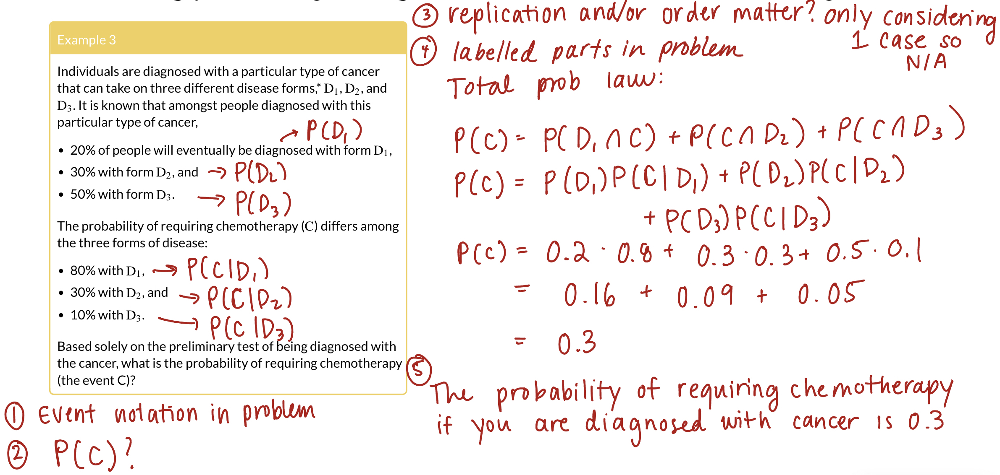

```{r setup, include=FALSE}
library(here)
library(tidyverse)

source(here("class_dates.R"))
```

# Learning objectives

1.  Define independence of 2-3 events and decide whether two or more events are independent

2.  Define key facts for conditional probabilities and calculate conditional probabilities.

3.  Calculate the probability of an event using Bayes' Theorem, Higher Order Multiplication Rule, and the Law of Total Probabilities

## Where are we?

{fig-align="center"}

## General Process for Probability Word Problems

1.  Clearly define your events of interest and mathematically define the goal probability

2.  Translate question to probability using defined events OR Venn Diagram

3.  Ask yourself:

    -   Are we sampling with or without replacement?

    -   Does order matter? (Are the objects distinguishable?)

4.  Use axioms, properties, partitions, facts, etc. to define the end probability calculation into smaller parts

    -   If probabilities are given to you, Venn Diagrams may help you parse out the events and probability calculations

    -   If you need to find probabilities with counting, pictures or diagrams might help here

5.  Write out a concluding statement that gives the probability context

6.  (For own check) Make sure the calculated probability follows the axioms. Is it between 0 and 1?

# Learning objectives

::: lob
1.  Define independence of 2-3 events and decide whether two or more events are independent
:::

2.  Define key facts for conditional probabilities and calculate conditional probabilities.

3.  Calculate the probability of an event using Bayes' Theorem, Higher Order Multiplication Rule, and the Law of Total Probabilities

## Independent Events

::::: definition
::: def-title
Definition: Independence
:::

::: def-cont
Events $A$ and $B$ are [**independent**]{style="color:#20c997;"} if $$\mathbb{P}(A \cap B) = \mathbb{P}(A) \cdot  \mathbb{P}(B).$$
:::
:::::

**Notation:** For shorthand, we sometimes write $A \mathrel{\unicode{x2AEB}} B,$ to denote that $A$ and $B$ are independent events.

 

-   Also note: $$\begin{aligned} \mathbb{P}(A \cap B) = \mathbb{P}(A) \cdot  \mathbb{P}(B) & \implies A \mathrel{\unicode{x2AEB}} B \\
    A \mathrel{\unicode{x2AEB}} B & \implies \mathbb{P}(A \cap B) = \mathbb{P}(A) \cdot  \mathbb{P}(B) \end{aligned}$$


## Example of two dice

::::: example
::: ex-title
Example 1
:::

::: ex-cont
Two dice (green and blue) are rolled. Let $A =$ event a total of 7 appears, and $B =$ event green die is a six. Are events $A$ and $B$ independent?
:::
:::::

::::::: columns
:::::: {.column width="50%"}

::::::
:::::: {.column width="50%"}

::::::
:::::::

## Example of two dice: simulating in R (1/2)

::::: example
::: ex-title
Example 1
:::

::: ex-cont
Two dice (green and blue) are rolled. Let $A =$ event a total of 7 appears, and $B =$ event green die is a six. Are events $A$ and $B$ independent?
:::
:::::

::: columns
::: {.column width="62%"}

-   First, a small simulation with 10 rolls of the two dice

```{r}
set.seed(1002) # <1>
reps <- 10 # <2>

dice <- expand_grid(sim = 1:reps) |> # <3>
  mutate(green = sample(1:6, n(), replace = TRUE), # <4>
         blue = sample(1:6, n(), replace = TRUE)) # <4>

dice_events <- dice |> # <5>
  mutate(A = green + blue == 7, # <6>
         B = green == 6) # <7>
```

1.  Set the seed once, so we get the same "random" rolls every time the slides are made.
2.  Save the number of simulations as `reps`, so it is easy to change later.
3.  One row for every simulation. Each simulation is one roll of the pair of dice.
4.  Each die is a box with tickets 1 to 6. `sample()` draws one ticket for every row (`n()` is the number of rows). `replace = TRUE` means any number can show up on both dice.
5.  Start with the table of dice and save the result as `dice_events`.
6.  `A` is `TRUE` when the total of the two dice is 7. The `==` asks "is it equal to?"
7.  `B` is `TRUE` when the green die is a six.
:::

::: {.column width="3%"}
:::

::: {.column width="35%"}
```{r}
dice_events # <1>
```

1.  Typing a name prints the table. Each row is one simulation.
:::
:::

## Example of two dice: simulating in R (2/2)

::::: example
::: ex-title
Example 1
:::

::: ex-cont
Two dice (green and blue) are rolled. Let $A =$ event a total of 7 appears, and $B =$ event green die is a six. Are events $A$ and $B$ independent?
:::
:::::

```{r}
#| code-fold: true
#| code-summary: "Same code, now with 10,000 simulations"

reps <- 10000 # <1>
dice <- expand_grid(sim = 1:reps) |> # <2>
  mutate(green = sample(1:6, n(), replace = TRUE), # <2>
         blue = sample(1:6, n(), replace = TRUE)) # <2>
dice_events <- dice |> # <2>
  mutate(A = green + blue == 7, # <2>
         B = green == 6) # <2>
```

1.  The only change: 10,000 simulations instead of 10.
2.  Same as before: roll the two dice and check events `A` and `B` in each simulation.

::: columns
::: column
Then we compare $\mathbb{P}(A) \cdot \mathbb{P}(B)$ with $\mathbb{P}(A \cap B)$

```{r}
dice_events |> # <1>
  summarise(p_A = mean(A), # <2>
            p_B = mean(B), # <2>
            p_A_times_p_B = p_A * p_B, # <3>
            p_A_and_B = mean(A & B)) # <4>
```

1.  Start with the table of events.
2.  `mean()` of a `TRUE`/`FALSE` column is the proportion of simulations where the event happened. R treats `TRUE` as 1 and `FALSE` as 0.
3.  $\mathbb{P}(A) \cdot \mathbb{P}(B)$: we can use columns we just made inside the same `summarise()`.
4.  $\mathbb{P}(A \cap B)$: `&` is "and", so this is the proportion of simulations where **both** events happened.

:::
::: column

 

 

 

 


::: extra
::: ext-cont
The last two columns are close to each other (and to $\frac{1}{36} \approx 0.0278$), which is what independence looks like

- Do **not** need to be *exactly* the same!
:::
:::
:::
:::

## Independence of 3 Events

::::: definition
::: def-title
Definition: Independence of 3 Events
:::

::: def-cont
*Events* $A$, $B$, and $C$ are *mutually* [**independent**]{style="color:#20c997;"} if

1.

    -   $\mathbb{P}(A \cap B) = \mathbb{P}(A) \cdot \mathbb{P}(B)$

    -   $\mathbb{P}(A \cap C) = \mathbb{P}(A) \cdot \mathbb{P}(C)$

    -   $\mathbb{P}(B \cap C) = \mathbb{P}(B) \cdot \mathbb{P}(C)$

2.  $\mathbb{P}(A \cap B \cap C) = \mathbb{P}(A) \cdot \mathbb{P}(B) \cdot \mathbb{P}(C)$
:::
:::::

-   Condition 1 says each pair is independent: $A \mathrel{\unicode{x2AEB}} B$, $A \mathrel{\unicode{x2AEB}} C$, and $B \mathrel{\unicode{x2AEB}} C$
-   Conditions 1 and 2 together mean $A$, $B$, and $C$ are *mutually* independent

**Remark:**

On your homework you will show that $(1) \not \Rightarrow (2)$ and $(2) \not \Rightarrow (1)$.

## Probability at least one smoker (extra reference on own)

::::::: columns
:::::: {.column width="34%"}
::::: example
::: ex-title
Example 2
:::

::: ex-cont
Suppose you take a random sample of $n$ people, in which each person is a smoker or non-smoker independently of the others. Let

-   $A_i =$ event person $i$ is a smoker, for $i=1, \ldots ,n$, and

-   $p_i =$ probability person $i$ is a smoker, for $i=1, \ldots ,n$.

Find the probability that at least one person in the random sample is a smoker.
:::
:::::
::::::
:::::: {.column width="66%"}
-   "At least one smoker" is the **complement** of "no smokers"

$$\mathbb{P}(\text{at least one smoker}) = 1 - \mathbb{P}(A_1^C \cap A_2^C \cap \cdots \cap A_n^C)$$

-   The people are [**independent**]{style="color:#20c997;"}, so their complements are too, and the probability of the intersection is a product

$$= 1 - \mathbb{P}(A_1^C) \cdot \mathbb{P}(A_2^C) \cdots \mathbb{P}(A_n^C) = 1 - \prod_{i=1}^{n} (1 - p_i)$$

-   If everyone has the same chance $p$ of smoking, this is $1 - (1 - p)^n$
::::::
:::::::

## Probability at least one smoker: simulating in R (extra reference on own)

Suppose every person has the same chance of smoking, $p = 0.2$, and we sample $n = 5$ people. The formula gives $1 - (1 - 0.2)^5 = 0.672$. Does the simulation agree?

```{r}
set.seed(2026) # <1>
reps <- 10000 # <2>
n_people <- 5 # <2>
p_smoker <- 0.2 # <2>

people <- expand_grid(sim = 1:reps, person = 1:n_people) |> # <3>
  mutate(smoker = sample(c(TRUE, FALSE), n(), replace = TRUE, # <4>
                         prob = c(p_smoker, 1 - p_smoker))) # <4>

smoker_sims <- people |> # <5>
  group_by(sim) |> # <5>
  summarise(any_smoker = any(smoker)) # <6>

smoker_sims |> # <7>
  summarise(prob_at_least_one = mean(any_smoker)) # <7>
```

1.  Set a new seed for this example.
2.  Save the number of simulations, the number of people, and the chance of smoking as named values, so they are easy to change.
3.  One row for every combination of simulation (a sample of 5 people) and person.
4.  Like the unfair coin in Lesson 1: `prob` gives each outcome its own chance, here 20% smoker and 80% non-smoker. Each person is drawn separately, which is what makes them independent.
5.  Handle each simulation (each sample of people) separately.
6.  `any()` is `TRUE` if at least one person in the sample is a smoker.
7.  The proportion of samples with at least one smoker.

## Building geometric series {visibility="hidden"}

::::: example
::: ex-title
Example 3
:::

::: ex-cont
$A, B,$ and $C$ toss a fair coin in order. The first to throw heads wins. What are their respective chances of winning?
:::
:::::

Let

-   $A_H$ and $A_T$ be the events player A tosses heads and tails, respectively.

-   Similarly define $B_H$, $B_T$, $C_H$, and $C_T$.

# Learning objectives

1.  Define independence of 2-3 events and decide whether two or more events are independent

::: lob
2.  Define key facts for conditional probabilities and calculate conditional probabilities.
:::

3.  Calculate the probability of an event using Bayes' Theorem, Higher Order Multiplication Rule, and the Law of Total Probabilities

## Let's revisit our deck of cards {visibility="hidden"}

:::::::: columns
:::::: {.column width="35%"}
::::: example
::: ex-title
Example 1
:::

::: ex-cont
Suppose we randomly draw 2 cards from a standard deck of cards. What is the probability that we draw a spade then a heart?
:::
:::::

Let

-   Let $A =$ event $1^{st}$ card is spades

-   Let $B =$ event $2^{nd}$ card is heart
::::::

::: column
:::
::::::::

## Conditional Probability facts (1/2)

::::::::::: columns
:::::: column
::::: fact
::: fact-title
Fact 1: General Multiplication Rule
:::

::: fact-cont
$$\mathbb{P}(A\cap B)=\mathbb{P}(A)\cdot\mathbb{P}(B|A) \\ \text{ and } \\ \mathbb{P}(A\cap B)=\mathbb{P}(B)\cdot\mathbb{P}(A|B)$$

:::
:::::

**Fact 1 in words:** the probability that $A$ **and** $B$ both happen is the probability that $A$ happens times the probability that $B$ happens **given** $A$ happened (or the same with $A$ and $B$ switched)
::::::

:::::: column
::::: fact
::: fact-title
Fact 2: Conditional Probability Definition
:::

::: fact-cont
$$\mathbb{P}(A|B)=\frac{\mathbb{P}(A\cap B)}{\mathbb{P}(B)} \text{ and } \mathbb{P}(B|A)=\frac{\mathbb{P}(A\cap B)}{\mathbb{P}(A)}$$
:::
:::::

**Fact 2 in words:** the [**conditional probability**]{style="color:#E25D3B;"} of $A$ **given** $B$ is the probability that $A$ happens when we already know $B$ happened
::::::
:::::::::::

## Conditional Probability facts (2/2)

::::::::::: columns
:::::: column
::::: fact
::: fact-title
Fact 3
:::

::: fact-cont
If $A$ and $B$ are independent events ($A \unicode{x2AEB}B$), then $$\mathbb{P}(A|B) = \mathbb{P}(A) \text{ and } \mathbb{P}(B|A) = \mathbb{P}(B)$$
:::
:::::

**Fact 3 in words:** if $A$ and $B$ are independent, knowing that $B$ happened does not change the probability that $A$ happens
::::::

:::::: column
::::: fact
::: fact-title
Fact 4
:::

::: fact-cont
$\mathbb{P}(A|B)$ is a probability, meaning that it satisfies the probability axioms. In particular, $$\mathbb{P}(A|B) + \mathbb{P}(A^C|B) = 1 \\ \text{ and } \\ \mathbb{P}(B|A) + \mathbb{P}(B^C|A) = 1$$
:::
:::::

**Fact 4 in words:** given that $B$ happened, the probability that $A$ happens and the probability that $A$ does not happen add up to 1
::::::
:::::::::::

## Conditional probability with two dice


::::: example
::: ex-title
Example 3
:::

::: ex-cont
Two dice (green and blue) are rolled. If the dice do not show the same face, what is the probability that one of the dice is a 1?
:::
:::::

::::::: columns
:::::: column

::::::
:::::: column

::::::
:::::::

## Conditional probability with two dice: simulations (1/2)

::::: example
::: ex-title
Example 3
:::

::: ex-cont
Two dice (green and blue) are rolled. If the dice do not show the same face, what is the probability that one of the dice is a 1?
:::
:::::

Reuse the 10,000 rolls, but with new events: $A$ = one die is a 1, and $B$ = the dice do not match

::: columns
::: {.column width="49%"}

```{r}
cond_sims <- dice |> # <1>
  mutate(A = green == 1 | blue == 1, # <2>
         B = green != blue) # <3>
```

1.  Start with the same `dice` table from Example 1 and save the result as `cond_sims`.
2.  `|` is "or", so `A` is `TRUE` when the green die is a 1 **or** the blue die is a 1 (or both).
3.  `!=` is "is not equal to", so `B` is `TRUE` when the two dice show different numbers.

:::

::: {.column width="3%"}
:::

::: {.column width="48%"}
```{r}
head(cond_sims, 10) # <4>
```

4.  `head()` prints the first 10 rows.

:::
:::

## Conditional probability with two dice: simulations (2/2)

::::: example
::: ex-title
Example 3
:::

::: ex-cont
Two dice (green and blue) are rolled. If the dice do not show the same face, what is the probability that one of the dice is a 1?
:::
:::::

::::::: columns
:::::: {.column width="54%"}

**One way to think about it:** Calculate each from all simulations and then divide
```{r}
cond_sims |> # <1>
  summarise(p_A_and_B = mean(A & B), # <2>
            p_B = mean(B), # <3>
            p_A_given_B = p_A_and_B / p_B) # <4>
```

1.  Start with the table of events.
2.  $\mathbb{P}(A \cap B)$: the proportion of simulations where both events happened.
3.  $\mathbb{P}(B)$: the proportion of simulations where the dice do not match.
4.  $\mathbb{P}(A|B) = \mathbb{P}(A \cap B) / \mathbb{P}(B)$, which is Fact 2.
::::::

:::::: {.column width="3%"}
::::::

:::::: {.column width="43%"}

**Another way to think about it:** given $B$, we only look at the simulations where $B$ happened

```{r}
cond_sims |> # <1>
  filter(B) |> # <2>
  summarise(p_A_given_B = mean(A)) # <3>
```

1.  Start with the table of events.
2.  `filter(B)` keeps only the rows where `B` is `TRUE`.
3.  Among those rows, the proportion where `A` happened.
::::::
:::::::

 

-   Both ways are close to $\frac{1}{3}$

## Monty Hall Problem

[Survivor Season 42](https://www.youtube.com/watch?v=6JGyiISwY1k)

[With the Wiki page on it!](https://en.wikipedia.org/wiki/Monty_Hall_problem)

## Monty Hall Problem: simulating in R

**Three doors:** a car is behind one, goats behind the other two. You pick a door, the host opens a different door with a goat, and you choose whether to **stay** or **switch**

```{r}
set.seed(1003) # <1>
reps <- 10000 # <2>

monty <- expand_grid(sim = 1:reps) |> # <3>
  mutate(car = sample(1:3, n(), replace = TRUE), # <4>
         pick = sample(1:3, n(), replace = TRUE), # <5>
         stay_wins = car == pick, # <6>
         switch_wins = car != pick) # <7>

monty |> # <8>
  summarise(p_stay = mean(stay_wins), # <8>
            p_switch = mean(switch_wins)) # <8>
```

1.  Set a new seed for this example.
2.  Save the number of simulations as `reps`.
3.  One row for every simulation (every game).
4.  The car is behind a random door from 1 to 3.
5.  You pick a random door from 1 to 3.
6.  If you **stay**, you win exactly when your first pick has the car.
7.  If you **switch**, the host has already removed a goat door, so you win exactly when your first pick was wrong.
8.  The proportion of games won by each strategy.

Switching wins about $\frac{2}{3}$ of the time. Why? Switching wins exactly when our first pick was wrong, and that has probability $\frac{2}{3}$

# Learning objectives

1.  Define independence of 2-3 events and decide whether two or more events are independent

2.  Define key facts for conditional probabilities and calculate conditional probabilities.

::: lob
3.  Calculate the probability of an event using Bayes' Theorem, Higher Order Multiplication Rule, and the Law of Total Probabilities
:::

## Bayes' Rule for two events

-   We can use the [**conditional probability**]{style="color:#E25D3B;"} ($\mathbb{P}(A|B)$) to get information on the flipped conditional probability ($\mathbb{P}(B|A)$)

::::::: columns
:::::: column
::::: theorem
::: thm-title
Theorem: Bayes' Rule (for two events)
:::

::: thm-cont
For any two events $A$ and $B$ with nonzero probabilities,

$$\mathbb{P}(A| B) =
\frac{\mathbb{P}(A) \cdot \mathbb{P}(B|A)}
{\mathbb{P}(B)}$$
:::
:::::
::::::
:::::::

## Calculating probability with Higher Order Multiplication Rule

::::::::::: columns
:::::: column
::::: example
::: ex-title
Example 4
:::

::: ex-cont
Suppose we draw 5 cards from a standard shuffled deck of 52 cards. What is the probability of a flush, that is all the cards are of the same suit (including straight flushes)?
:::
:::::
::::::

:::::: column
::::: fact
::: fact-title
Higher Order Multiplication Rule
:::

::: fact-cont
$$\begin{aligned} \mathbb{P}(A_1\cap & A_2 \cap  \ldots \cap A_n)= \\ & \mathbb{P}(A_1)\cdot\mathbb{P}(A_2|A_1) \cdot \\
& \mathbb{P}(A_3|A_1A_2)\ldots \cdot\mathbb{P}(A_n|A_1A_2\ldots A_{n-1})
\end{aligned}$$
:::
:::::
::::::
:::::::::::

## Calculating probability with Law of Total Probability

::::::::::: columns
:::::: column
::::: example
::: ex-title
Example 5
:::

::: ex-cont
Suppose 1% of people assigned female at birth (AFAB) and 5% of people assigned male at birth (AMAB) are color-blind. Assume person born is equally likely AFAB or AMAB (not including intersex). What is the probability that a person chosen at random is color-blind?
:::
:::::
::::::

:::::: column
::::: fact
::: fact-title
Law of Total Probability for 2 Events
:::

::: fact-cont
For events $A$ and $B$,

$$%\left(
\begin{array}{ccl}
\mathbb{P}(B)&=&\mathbb{P}(B \cap A) + \mathbb{P}(B \cap A^C)\\
           &=& \mathbb{P}(B|A) \cdot \mathbb{P}(A)+ \mathbb{P}(B | A^C)\cdot \mathbb{P}(A^C)
\end{array}
%\right)$$
:::
:::::
::::::
:::::::::::

## General Law of Total Probability

::::: fact
::: fact-title
Law of Total Probability (general)
:::

::: fact-cont
If $\{A_i\}_{i=1}^{n} = \{A_1, A_2, \ldots, A_n\}$ form a partition of the sample space, then for event $B$,

$$%\left(
\begin{array}{ccl}
\mathbb{P}(B)&=& \sum_{i=1}^{n} \mathbb{P}(B \cap A_i)\\
           &=& \sum_{i=1}^{n} \mathbb{P}(B|A_i) \cdot \mathbb{P}(A_i)
\end{array}
%\right)$$
:::
:::::

```{=html}
<div style="text-align:center;"><svg viewBox="0 0 300 170" style="width:950px; max-width:100%; height:auto; font-family:Lato, 'Helvetica Neue', Arial, sans-serif" xmlns="http://www.w3.org/2000/svg" role="img"><title>Blank sample space box</title><rect x="6" y="6" width="250" height="160" fill="none" stroke="#222" stroke-width="1"/><text x="240" y="30" text-anchor="end" font-size="18" font-style="italic" fill="#222">S</text></svg></div>
```

## Calculating probability with generalized Law of Total Probability {.smaller}

{fig-align="center"}

## Calculating probability with generalized Law of Total Probability {visibility="hidden"}

:::::::: columns
:::::: {.column width="40%"}
::::: example
::: ex-title
Example 3
:::

::: ex-cont
Individuals are diagnosed with a particular type of cancer that can take on three different disease forms,\* $D_1$, $D_2$, and $D_3$. It is known that amongst people diagnosed with this particular type of cancer,

-   20% of people will eventually be diagnosed with form $D_1$,

-   30% with form $D_2$, and

-   50% with form $D_3$.

The probability of requiring chemotherapy ($C$) differs among the three forms of disease:

-   80% with $D_1$,

-   30% with $D_2$, and

-   10% with $D_3$.

Based solely on the preliminary test of being diagnosed with the cancer, what is the probability of requiring chemotherapy (the event C)?
:::
:::::
::::::

::: column
Skipping in class! Let me know if you would like me to post solutions to this if you work through it!
:::
::::::::

## Let's revisit the color-blind example {visibility="hidden"}

::::::: columns
:::::: {.column width="40%"}
::::: example
::: ex-title
Example 4
:::

::: ex-cont
Recall the color-blind example (Example [2](#Ex_colorblind){reference-type="ref" reference="Ex_colorblind"}), where

-   a person is AMAB with probability 0.5,

-   AMAB people are color-blind with probability 0.05, and

-   all people are color-blind with probability 0.03.

Assuming people are AMAB or AFAB, find the probability that a color-blind person is AMAB.
:::
:::::
::::::
:::::::

## Calculate probability with both rules

::::::: columns
:::::: {.column width="40%"}
::::: example
::: ex-title
Example 6
:::

::: ex-cont
Suppose

-   1% of people who are AFAB aged 40-50 years have breast cancer,

-   an AFAB person with breast cancer has a 90% chance of a positive test from a mammogram, and

-   an AFAB person has a 10% chance of a false-positive result from a mammogram.

What is the probability that an AFAB person has breast cancer given that they just had a positive test?
:::
:::::
::::::
:::::::

## Calculate probability with both rules: simulating in R

We simulate using **only the information given in the problem**: 

```{r}
set.seed(2027) # <1>
reps <- 100000 # <2>
p_cancer <- 0.01; p_pos_if_cancer <- 0.9; p_pos_if_no_cancer <- 0.1 # <3>

people <- expand_grid(sim = 1:reps) |> # <4>
  mutate(cancer = sample(c(TRUE, FALSE), n(), replace = TRUE, # <5>
                         prob = c(p_cancer, 1 - p_cancer)), # <5>
         pos_if_cancer = sample(c(TRUE, FALSE), n(), replace = TRUE, # <6>
                                prob = c(p_pos_if_cancer, 1 - p_pos_if_cancer)), # <6>
         pos_if_no_cancer = sample(c(TRUE, FALSE), n(), replace = TRUE, # <7>
                                   prob = c(p_pos_if_no_cancer, 1 - p_pos_if_no_cancer)), # <7>
         positive = if_else(cancer, pos_if_cancer, pos_if_no_cancer)) # <8>

people |> # <9>
  filter(positive) |> # <9>
  summarise(prob_cancer_given_pos = mean(cancer)) # <10>
```

1.  Set a new seed for this example.
2.  Save the number of simulations as `reps`. We use 100,000 because breast cancer with a positive test is fairly rare.
3.  Save the three probabilities from the problem as named values, so they are easy to change.
4.  One row per simulated AFAB person aged 40-50 years.
5.  Does this person have breast cancer? Like the unfair coin in Lesson 1, `prob` gives `TRUE` (cancer) a 1% chance and `FALSE` a 99% chance.
6.  What the mammogram **would** show if this person has cancer: positive with probability 0.9.
7.  What the mammogram **would** show if this person does not have cancer: a false positive with probability 0.1.
8.  New function: `if_else(condition, value_if_TRUE, value_if_FALSE)` picks a value for each row. If the person has cancer, we keep `pos_if_cancer`. Otherwise we keep `pos_if_no_cancer`. This is how the test result depends on cancer status.
9.  "Given a positive test" means we only keep the people with a positive test. `filter(positive)` keeps the rows where `positive` is `TRUE`.
10.  Among the positive tests, the proportion that have cancer. This should be close to our answer of 0.0833.

## Bayes' Rule expanded to $n$ partitions

::::: theorem
::: thm-title
Theorem: Bayes' Rule
:::

::: thm-cont
If $\{A_i\}_{i=1}^{n}$ form a partition of the sample space $S$, with $\mathbb{P}(A_i)>0$ for $i=1\ldots n$ and $\mathbb{P}(B)>0$, then

$$\mathbb{P}(A_j | B) =
\frac{\mathbb{P}(B|A_j) \cdot \mathbb{P}(A_j)}
{\sum_{i=1}^{n} \mathbb{P}(B|A_i) \cdot \mathbb{P}(A_i)}$$
:::
:::::

```{=html}
<div style="text-align:center;"><svg viewBox="0 0 300 170" style="width:950px; max-width:100%; height:auto; font-family:Lato, 'Helvetica Neue', Arial, sans-serif" xmlns="http://www.w3.org/2000/svg" role="img"><title>Blank sample space box</title><rect x="6" y="6" width="250" height="160" fill="none" stroke="#222" stroke-width="1"/><text x="240" y="30" text-anchor="end" font-size="18" font-style="italic" fill="#222">S</text></svg></div>
```
